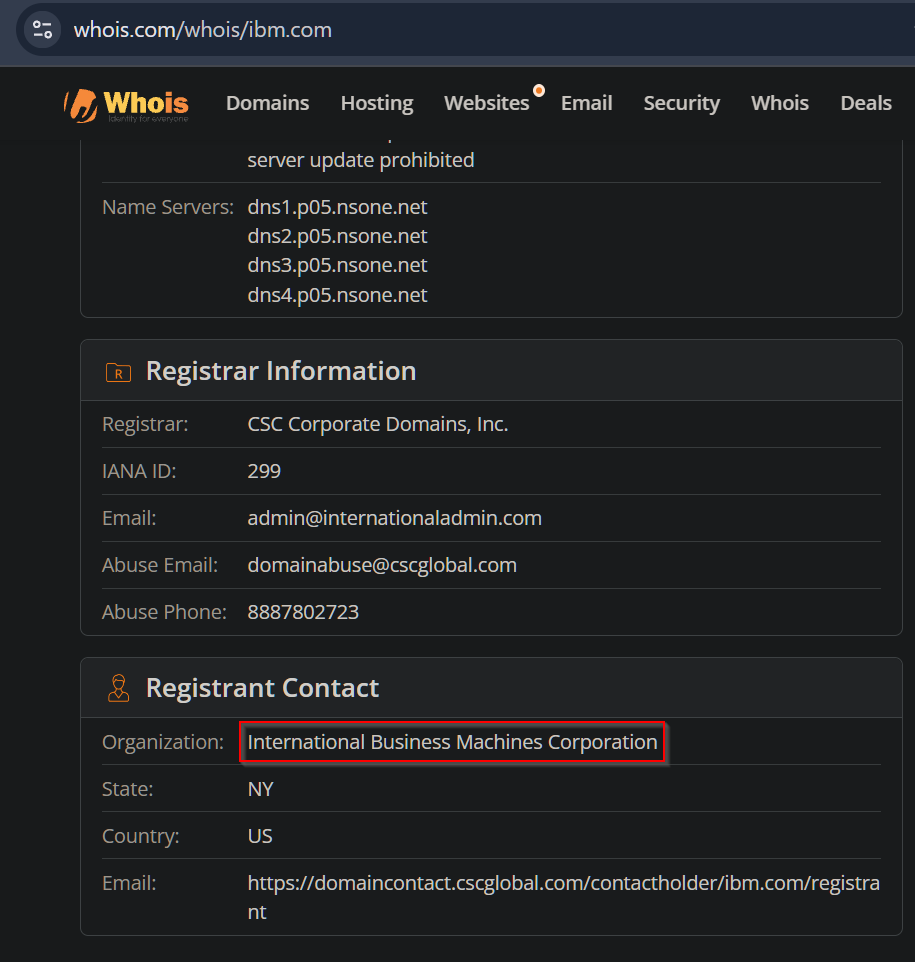
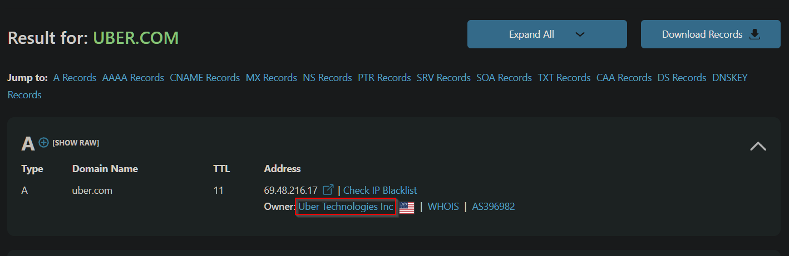
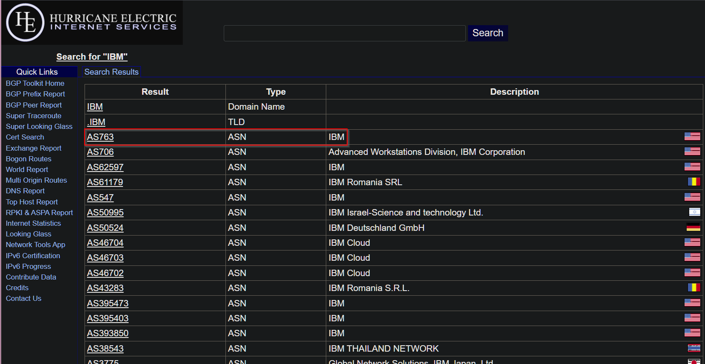
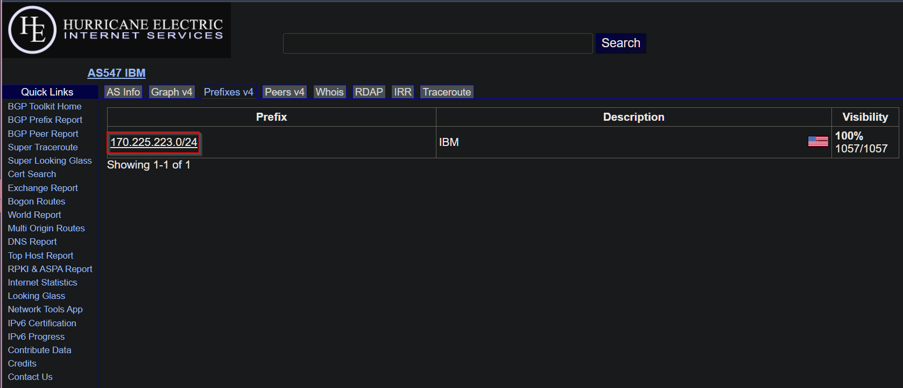
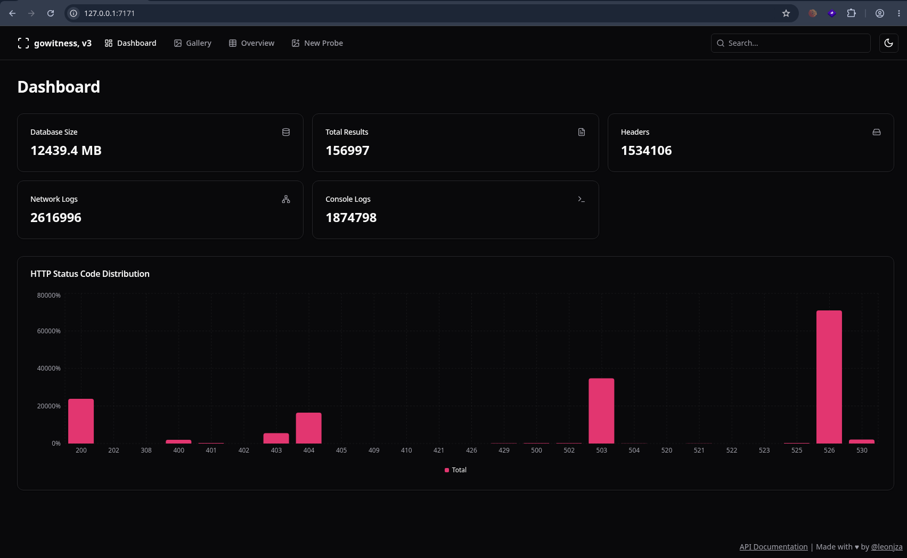

# 1. Asset Discovery: Find Apex Domains

---

## Whois or DNSChecker

Get Your Target's Organization Name...

---

### [Whois](https://www.whois.com/whois)  

#### Example: For IBM

Whois works: https://www.whois.com/whois/ibm.com



### [DNSChecker](https://dnschecker.org/all-dns-records-of-domain.php)

#### Example: For Uber

DNSChecker works: https://dnschecker.org/all-dns-records-of-domain.php?query=uber.com&rtype=ALL&dns=google



---

## ASNs + IP Ranges

Get your target's Autonomous System Numbers (ASNs) and/or IP ranges...


You can use the [data scraper chrome extension](https://chromewebstore.google.com/detail/instant-data-scraper/ofaokhiedipichpaobibbnahnkdoiiah?hl=en-US) to copy the IPs and ASNs.


---

### https://bgp.he.net/

1. Search for organization's names. There may be multiple names.
2. Save the ASN numbers.
   
3. Click on the ASN# -> Prefixes v4 to get the IP ranges and save them to a `ips.txt` file.
   

### [Asrank](https://asrank.caida.org/asns/by-name/)

1. Search for organization names. There may be multiple names.
2. Save the ASN number.
3. Go to https://bgp.he.net/ to get the IPv4 ranges and save them to a `ips.txt` file.


You can use [org2ip-asn](https://github.com/blue-pho3nix/org2ip-asn) instead, but you might miss some ASNs or IP ranges.


### [Arin](https://whois.arin.net/ui/) and [Ripe](https://apps.db.ripe.net/db-web-ui/fulltextsearch)

1. Search for organization names. There may be multiple names.
2. Save the IP ranges as CIDR (Example: 66.90.225.72/29) to a `ips.txt` file.

---

## Caduceus

Use Caduceus to get subdomains and apex domains...

---

1. Install [Caduceus](https://github.com/g0ldencybersec/Caduceus)

   ```bash
   sudo apt update && sudo apt install -y gcc golang
   ```

   ```bash
   CGO_ENABLED=1 go install github.com/g0ldencybersec/Caduceus/cmd/caduceus@latest
   ```

2. Add the following path to the end of your `.zshrc` or `.bashrc`

   ```bash
   export PATH=$HOME/go/bin:$PATH
   ```

3. Restart your shell: `source ~/.zshrc` or `source ~/.bashrc`.

4. Cat your IP text file and run it to Caduceus

   ```bash
   cat ips.txt | caduceus | tee caduceus.txt
   ```

5. Install [unfurl](https://github.com/tomnomnom/unfurl)

   ```bash
   go install github.com/tomnomnom/unfurl@latest
   ```

6. Get the apex domains from your Caduceus output.

   ```bash
   cat caduceus.txt | unfurl -u apexes | tee caduceus-apex-domains.txt
   ```

7. Check your apex domains with my [vibe coded python script](https://raw.githubusercontent.com/blue-pho3nix/scripts/refs/heads/main/whois_check.py), replacing `<org>` with your target's organization (example: International Business Machines Corporation).

   
   Note: My script isn't perfect. Feel free to reach out on Discord or create an issue if anything comes up.
   

   ```bash
   wget https://raw.githubusercontent.com/blue-pho3nix/scripts/refs/heads/main/whois_check.py
   ```

   ```bash
   python whois_check.py --org "<org>" -l caduceus-apex-domains.txt -o valid-caduceus-apex-domains.txt
   ```

---

## Whoxy

Use Whoxy to get Apex Domains...

---

1. Buy [Reverse Whois API Queries](https://www.whoxy.com/pricing.php).
   
   Note: 1,000 for $10 is fine for now.
   

2. Get Apex domains, replacing `<company` with the url encoded Organization (Example:
   International+Business+Machines+Corporation), and `<api-key>` with your [API key](https://www.whoxy.com/account/api.php).

   
   Note: This will get you the first 2,500 results. You can fetch more by page (start after page 25). More details [here](https://www.whoxy.com/reverse-whois/). If you fetch by page, make sure to keep `tee -a whoxy-output` to get all the domains in step 3.
   

   ```bash
   curl "https://api.whoxy.com/?key=<api-key>&reverse=whois&company=<compay>&mode=micro" | tee -a whoxy-output
   ```

3. Cat out your Whoxy output and get your apex domains.

   ```bash
   cat whoxy-output | jq -r '.search_result[].domain_name' | tee whoxy-apex-domains.txt
   ```

4. Check your apex domains with my [vibe coded python script](https://raw.githubusercontent.com/blue-pho3nix/scripts/refs/heads/main/whois_check.py), replacing `<org>` with your target's organization (example: International Business Machines Corporation).
   
   ```bash
   wget https://raw.githubusercontent.com/blue-pho3nix/scripts/refs/heads/main/whois_check.py
   ```

   ```bash
   python whois_check.py --org "<org>" -l whoxy-apex-domains.txt -o valid-whoxy-apex-domains.txt
   ```

---

## Apex Domains Sorta Done!

Combine Your Apex Domain Files...

   ```bash
   cat valid-whoxy-apex-domains.txt valid-caduceus-apex-domains.txt | sort -u | tee valid-apex-domains.txt
   ```

---

# 2. Subdomain Scraping 🎉

---

## Subfinder

Use [Subfinder](https://github.com/projectdiscovery/subfinder) to get subdomains...

---


Make sure to add you API keys to `~/.config/subfinder/provider-config.yaml`


1. Install Subfinder

   ```bash
   go install -v github.com/projectdiscovery/subfinder/v2/cmd/subfinder@latest
   ```

2. Run the following command

   ```
   subfinder -dL valid-apex-domains.txt -all  -o subfinder-subdomains.txt
   ```

---

## Assetfinder

Use [Assetfinder](https://github.com/tomnomnom/assetfinder) to get subdomains...

---

1. Install Assetfinder

   ```bash
   go install github.com/tomnomnom/assetfinder@latest
   ```

2. Run the following loop

   ```bash
   while IFS= read -r domain; do
     [ -n "$domain" ] || continue
     assetfinder --subs-only "$domain" | tee -a assetfinder-valid-apex-domains.txt
   done < valid-apex-domains.txt
   ```

---

# 3. Subdomain Mutations

---

## Alterx

Use Alterx to create some subdomain mutations...

---

1. Install Alterx

   ```bash
   go install github.com/projectdiscovery/alterx/cmd/alterx@latest
   ```

2. Run the following command

   ```bash
   alterx -l subfinder-subdomains.txt -o alterx-subfinder-subdomains.txt
   ```

---

# 4. Is it active? + Increase Attack Surface 

---

## Compile everything

Get all the domains, subdomains, and IPs into one file...


`cat` all your files into one `everything.txt` file. Don't include `ips.txt` if IPs are not in scope.



```bash
cat valid-apex-domains.txt  alterx-subfinder-subdomains.txt assetfinder-valid-apex-domains.txt subfinder-subdomains.txt ips.txt | sort -u | tee everything.txt
```

---

## Dnsx + Naabu + Httpx

Get the active assets... get open ports and increase your attack surface... find out what's serving web content...

---

1. Install Dnsx + [Naabu](https://github.com/projectdiscovery/naabu) + [Httpx](https://github.com/projectdiscovery/httpx)
   
   If this is your first time installing, you'll want to delete `which httpx` first.
   

   ```bash
   go install -v github.com/projectdiscovery/dnsx/cmd/dnsx@latest
   ```
   ```bash
   go install -v github.com/projectdiscovery/naabu/v2/cmd/naabu@latest
   ```
   ```bash
   go install -v github.com/projectdiscovery/httpx/cmd/httpx@latest
   ```

2. Get the valid subdomains + ports + web content

   
   For naabu, this just gets the top 100 ports. If you want more ports run `--top-ports full` or `--top-ports 1000`.  In addition, you can add / remove flags and even screenshot with httpx (if you don't want to screenshot with gowitness).
    

   ```bash
   dnsx -l everything.txt -r ./resolvers.txt | naabu -silent | httpx -title -sc -cl -location -fr -o httpx_naabu_dnsx_everything.txt
   ```

---

# 5. Screenshots

---

## Gowitness

Make it easier to see `/` of each (sub)domain/IP...


I use gowitness, but feel free to use whatever you want ([Eyewitness](https://github.com/RedSiege/EyeWitness), [Eyeballer](https://github.com/BishopFox/eyeballer))


---

1. Install [gowitness](https://github.com/sensepost/gowitness)

   ```bash
   go install github.com/sensepost/gowitness@latest
   ```

2. Get screenshots

   ```bash
   gowitness scan file -f input --write-db --screenshot-fullpage
   ```

3. Open the server

   ```bash
   gowitness report server
   ```

4. Navigate to `http://127.0.0.1:7171`



---
# Note


You can also get subdomains via bruteforcing, [GitHub](https://github.com/gwen001/github-subdomains), etc. And, feel free to pipe commands and/or make a script, etc... This is only the beginning of recon. You may also like using [Karma v2](https://github.com/Dheerajmadhukar/karma_v2).


---

# References

This is where I learned a bunch of this...

---



- [Modern Recon for Red Teamers and Pentestrs: Slides](https://www.canva.com/design/DAG1RdVlHgA/T0rIrJniW2SJKj4bM94jYg/view?utm_content=DAG1RdVlHgA&utm_campaign=designshare&utm_medium=link2&utm_source=uniquelinks&utlId=hb059ca176f#1)



- [hackinghub: Project Discovery Tools](https://app.hackinghub.io/hubs/pd-tools)

---

