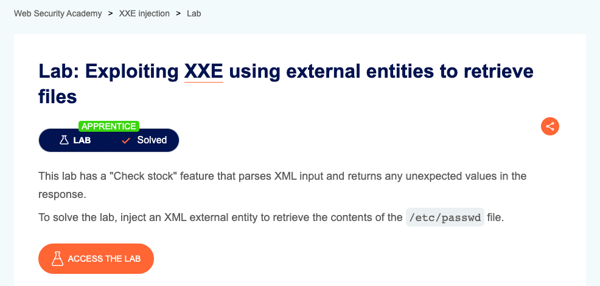
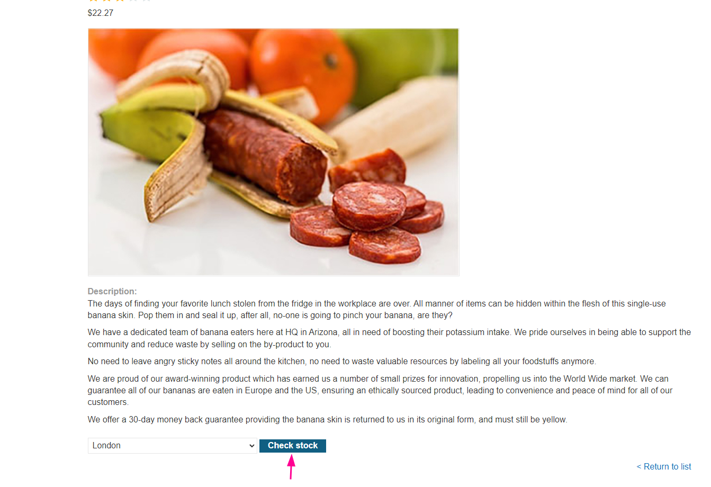
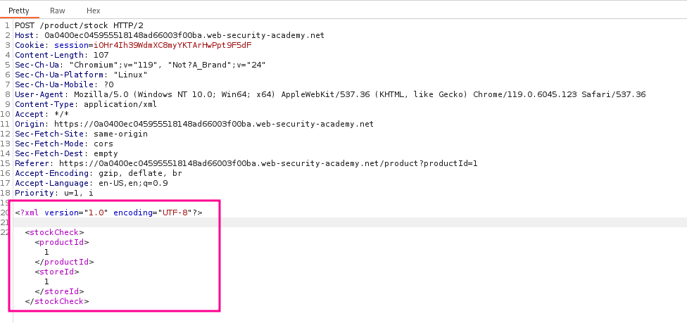
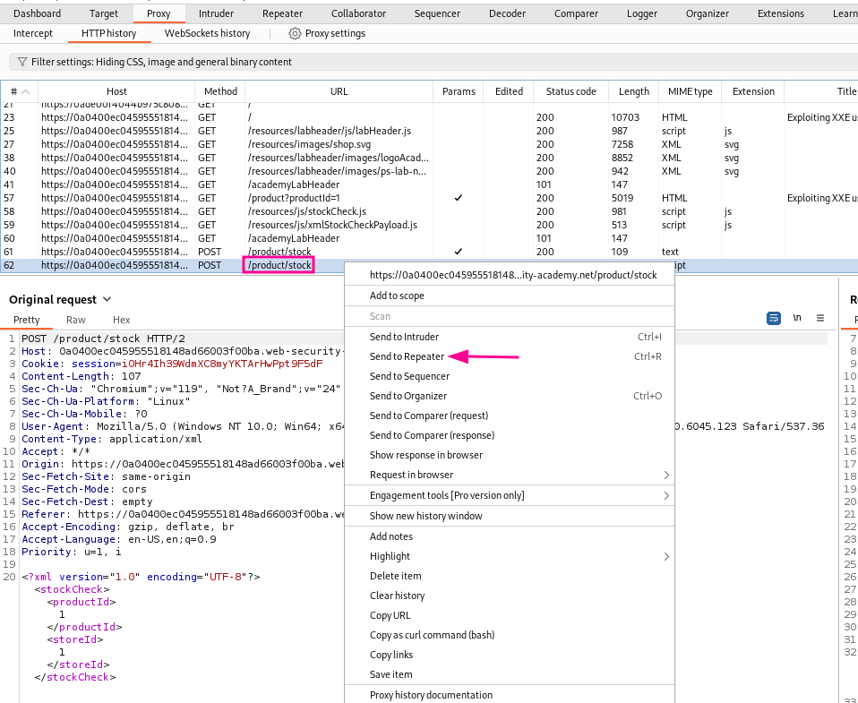
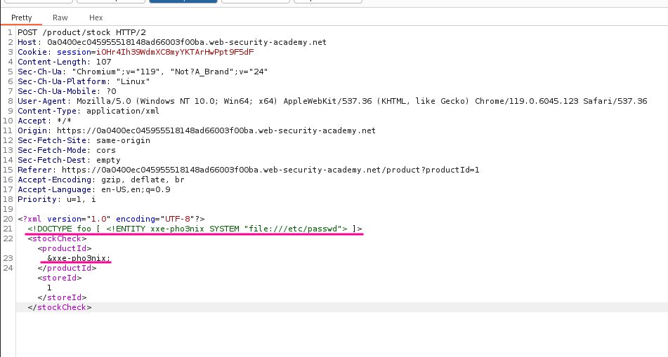
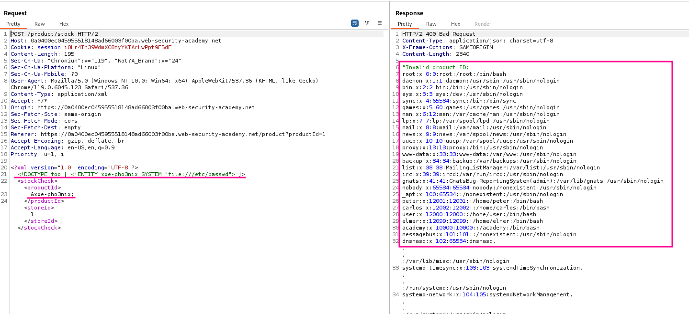

+++
author = "Blue Pho3nix"
title = "Lab: Portswigger Web Security Academy Exploiting XXE Using External Entities to Retrieve Files"
categories = ["PortSwigger"]
tags = [ "easy","XXE" ]
image = "categories/portswigger/portswigger-edit.png"
+++

</br>


## Description



> [This lab](https://portswigger.net/web-security/xxe/lab-exploiting-xxe-to-retrieve-files) has a "Check stock" feature that parses XML input and returns any unexpected values in the response.</br> To solve the lab, inject an XML external entity to retrieve the contents of the `/etc/passwd` file.

## Skill Learned

- [Exploiting XXE to retrieve files](https://portswigger.net/web-security/xxe#exploiting-xxe-to-retrieve-files), where an external entity is defined containing the contents of a file, and returned in the application's response.

# Solution

## Finding the vulnerability

Based on the lab description, our objective is to inject an XML external entity in order to retrieve the contents of the `/etc/passwd` file.

We also know that the "Check stock" feature of the application parses XML input and returns unexpected values in the response.

To proceed with the exploitation, we can use `BurpSuite` and navigate to a product page.

In the product details, we can click on "Check stock" where we will find the XML input that we can use to retrieve the `/etc/passwd` file.





## Exploitation

Let us consider our attack scenario:
Send the `/product/stock` request to `Repeater`.



Incorporate a `DOCTYPE` element that defines an external entity that contains the `/etc/passwd` file, using the defined entity in the `productID` value.



Retrieve the `/etc/passwd` file in the `/product/stock` response.



The attack explained above can be implemented with the following payload:

```xml
<?xml version="1.0" encoding="UTF-8"?>
    <!DOCTYPE foo [ <!ENTITY xxe-pho3nix SYSTEM "file:///etc/passwd"> ]>
        <stockCheck>
            <productId>
                &xxe-pho3nix;
            </productId>
            <storeId>
                1
            </storeId>
        </stockCheck>
```
